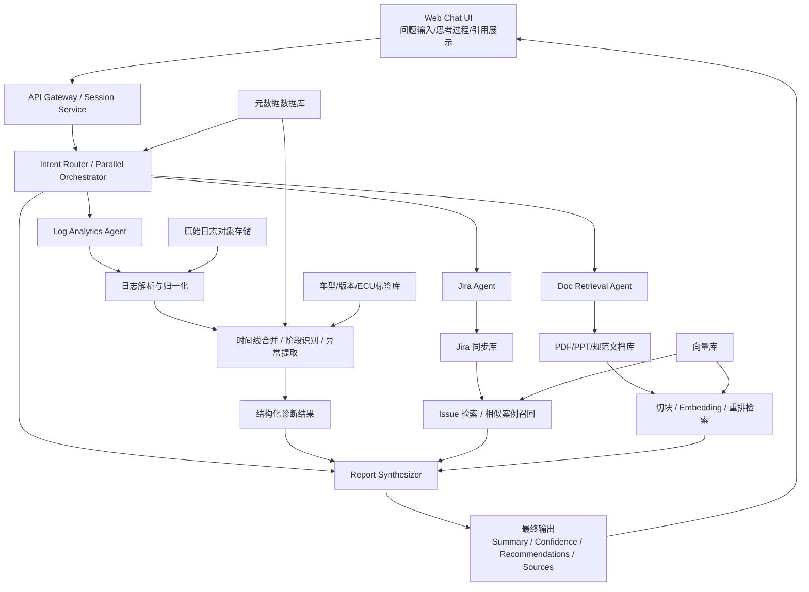
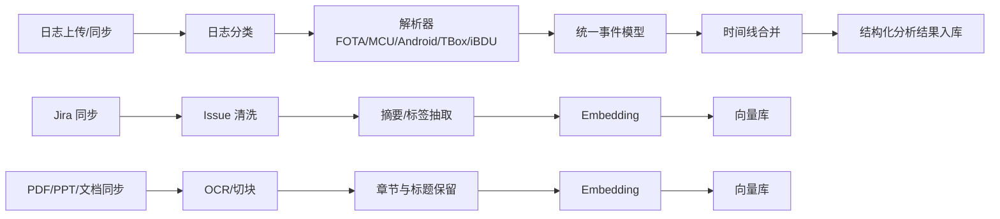
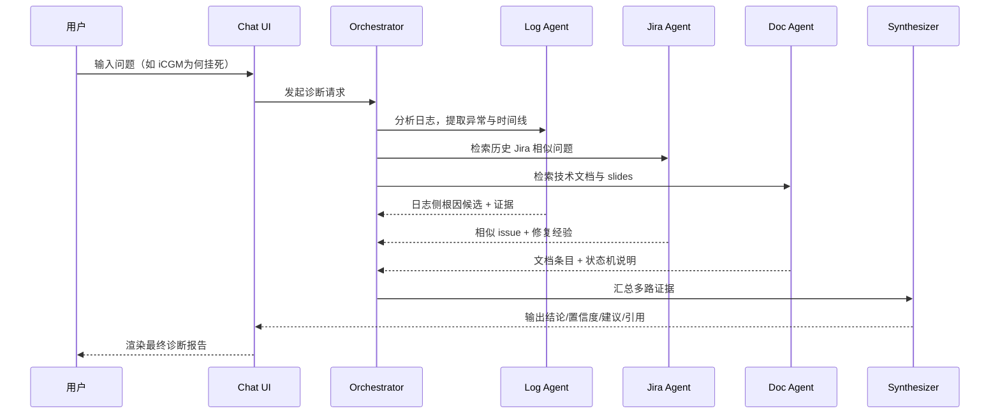

# `demo.mp4` 解说提取与落地架构反推

## 1. 说明

这份文档基于以下信息综合整理：

1. 对 `视频/demo.mp4` 音频做了自动转写。
2. 对视频关键帧做了画面校验。
3. 对明显误识别的专有名词做了人工修正。

因此，下面的“解说提取稿”是 **尽量完整、尽量贴近原话的校正版**。  
其中个别英文名词或品牌词可能仍有少量偏差，但不影响对系统结构的判断。

相关中间产物已保存：

1. `log_analysis_output/demo视频解说转写_tiny.txt`
2. `log_analysis_output/demo_chunk_transcripts/000_120.txt`
3. `log_analysis_output/demo_chunk_transcripts/120_240_tiny.txt`
4. `log_analysis_output/demo_chunk_transcripts/240_330.txt`
5. `log_analysis_output/demo_chunk_transcripts/330_454_tiny.txt`

## 2. 解说完整提取稿（校正版）

### 2.1 第一段：基础版 FOTA 诊断 Demo

“首先我们来测试一下第一个 demo。

第一个 demo 的话，我们后台已经把所有数据都加载好了，也把所有日志都做了预处理，包括 embedding，以及一系列基于 AI Technician 的数据处理。

现在我们可以直接对这个 AI Technician 提问。比如说，我们问一个问题：`iCGM 为何挂死？`

当我们问这个问题之后，AI Technician 会先理解问题，然后通过一个 orchestrator，把这个问题拆成若干个小步骤，再把这些步骤分发给不同的 agent 去执行。

比如现在，我们会有一个 Log Analytics Agent，专门去分析和 iCGM 相关的日志文件，提取挂死的具体原因和异常信息。

现在这个问题已经被传给 Log Analytics Agent 了。它正在读取日志并进行分析。

因为这个日志文件非常大。我们从 Maxus 拿到的日志，接近 500 个文件，总大小大约 5GB，日志总行数大概在数百万级别。

所以日志规模非常大。但你可以看到，大概 30 秒左右，它就能给出第一版结果。”

### 2.2 第二段：结果呈现方式

“这个回复分成两部分。

一部分是 thinking process，也就是中间过程。你可以把它折叠起来，不去关注过多细节。

灰色字体部分，就是 AI Technician 的中间推理过程。

白色字体部分，是最终给用户看的正式结果。

比如说这里，它会先告诉你信息来源。主要来源包括：

1. 日志内容分析
2. 系统日志片段
3. 多条日志之间的相互印证

所以它给出的结果置信度是比较高的，因为它不是只看一条日志，而是多条日志互相佐证，逻辑也比较完整。”

### 2.3 第三段：第一版根因结论

“那它发现了什么？

它的结论是：iCGM 挂死的根本原因，是在 FOTA 升级过程中，MPU，也就是 IVI 侧升级包下载被异常中断，最终导致系统进入反复下载、校验失败、再重启、再下载的死循环。

具体过程是这样的：

在某个时间点，系统开始升级 MCU 和 IPK。  
MCU 和 IPK 升级完成之后，系统发生了一次 reboot。

这个 reboot 非常关键，因为它打断了后续 MPU 升级包的下载过程。

此时 MPU 这个大包还在后台下载，包大小大约 2.1GB。  
系统在重启过程中把下载流程中断了。

重启之后，系统管理器误以为这个包已经下载完成，但实际上文件大小已经变成 0 字节，或者关键文件已经不存在。

于是后续文件校验失败，并报出文件不存在。

校验失败以后，系统又把升级状态重置。  
下一次重启之后，它又重新进入下载流程。

这样就形成了：

下载中断 -> 校验失败 -> 状态重置 -> 再次下载 -> 再次中断

最后就形成一个死循环。

这个死循环会持续消耗网络、存储、系统资源，最终把 iCGM 或相关模块拖死，造成整机卡死或者长时间无响应。”

### 2.4 第四段：第一版建议

“在给出这个分析以后，AI Technician 还会给出一些安全提示和整改建议。

比如说：

1. 要避免升级过程中的异常重启。
2. 要加强文件完整性校验。
3. 要修正升级状态机的状态重置逻辑。
4. 要避免在文件实际未落盘时，把下载状态误判为完成。

所以你看，光基于日志，它已经能给出一个比较完整的结果。

我觉得这个价值还是非常大的，因为这可能可以帮我们节省工程师大量排查时间。”

### 2.5 第五段：切换到带 Jira / 文档增强的 Demo

“但是，我们还想看一下：

如果系统在已有数据资料存在的情况下，是不是还能进一步提高它的判断效果。

所以现在我们把这个 demo 切换成带 Jira 的版本，也就是 `Maxus FOTA Diagnostic with Jira Demo`。

切换之后，后台数据源就不只是日志了，还额外接入了 Maxus 提供的知识库和历史问题资料。”

### 2.6 第六段：第二版 Demo 的数据源

“这个版本除了日志之外，还增加了两类数据资源：

1. 历史 Jira tickets
2. 内部的支持文档 / slides

其中 Jira tickets 记录了以往 FOTA 刷写失败、死循环、状态不一致等问题的描述和解决方案。

slides 则是 Maxus 内部工程师整理的一些深度分析材料，比如：

1. FOTA 状态机流程
2. 异常场景处理要点
3. 挂死或死循环原因分析

这样的话，这个系统就不只是读日志，还能读历史经验和离线文档。”

### 2.7 第七段：并行 Agent 工作方式

“你看这个时候，它这个 parallel orchestrator 把问题拆成了两个步骤：

1. 一个是 Log Analytics Agent
2. 一个是 Maxus Jira Agent

其中 Maxus Jira Agent 是我们为了这个 demo 后台搭建的一个组件。

它专门负责理解和阅读后台提供的一些支持文档、历史工单和知识资料。

也就是说，现在这个系统已经不只是一个日志分析 agent，而是一个多 agent 的联合诊断系统。”

### 2.8 第八段：Jira / 文档增强后的价值

“你看，现在 Maxus Jira Agent 给出来的结果就非常详细。

它不只是给你结论，还会告诉你结论的来源出处，让你有迹可循。

比如它会告诉你：

1. 参考了哪两份离线文档
2. 参考了哪些 PPT 或 PDF
3. 参考了哪些历史 Jira 工单
4. 哪些结论来自实际日志分析

也就是说，最终结论不是模型凭空生成的，而是：

日志证据 + 历史工单 + 内部技术文档

共同支撑出来的。”

### 2.9 第九段：增强版结论的内容

“这个增强版结果里，它不仅能告诉你：

1. 当前问题的直接原因
2. 还会告诉你类似问题在历史上出现过多少次
3. 历史问题的根因是什么
4. 为什么当前问题和历史问题是同一类问题
5. 最后应该怎么改

比如它会指出：

1. 部分 ECU 先升级完成，部分 ECU 仍未完成，导致状态不一致。
2. 状态不一致之后，系统却错误地推进到下一阶段。
3. 下一阶段又依赖某些大包已完整下载，但实际上 MPU 包并没有真正写完整。
4. 最终形成下载、刷写、重启之间的异常循环。

所以它不仅回答‘是什么问题’，还能回答：

1. 这个问题为什么会发生
2. 历史上有没有类似问题
3. 这个问题在状态机层面属于哪一类缺陷
4. 需要改日志、改状态机，还是改文件校验”

### 2.10 第十段：最终输出形态

“最后这个 demo 给出的，不只是一个聊天答案，而是一份比较工程化的诊断结论。

它会包括：

1. 关键结论
2. 直接原因
3. 根本原因
4. 推荐改进建议
5. 引用文档
6. 历史 Jira 工单
7. 日志中的关键证据

所以这个 demo 的核心价值，不只是会聊天，而是能把分散在日志、文档、Jira 里的信息整合起来，形成一个可以追溯、可以验证、可以复用的技术结论。”

## 3. 从解说反推出来的系统结构

结合解说和画面，这个系统的真实结构大概率比普通 RAG 更复杂，至少包含 6 层。

### 3.1 接入层

负责承接用户问题和多种分析入口。

可能包含：

1. Web Chat UI
2. Demo 切换页
3. 上传日志入口
4. 历史案例查询入口

### 3.2 编排层

这是 demo 里最明显的一层，因为视频里直接出现了：

1. `Parallel Orchestrator`
2. `Log Analytics Agent`
3. `Maxus Jira Agent`

说明系统至少有：

1. 任务理解
2. 任务拆解
3. 并行调度
4. 结果汇合

### 3.3 日志分析层

这一层不是纯 LLM，而是“规则 + 结构化解析 + LLM总结”。

至少要做：

1. 日志预处理
2. 多源日志归一化
3. 时间线合并
4. FOTA 阶段识别
5. 异常锚点提取
6. 证据片段抽取

### 3.4 知识检索层

从解说里能明确反推这层存在：

1. Jira tickets
2. PDF / PPT / slides
3. 内部支持文档

这意味着一定有：

1. 文档切块
2. 文档索引
3. 相似问题召回
4. 来源去重与重排

### 3.5 证据融合层

这是这个系统比普通“问答助手”更重要的地方。

它不是直接回答，而是把多个 agent 的结果合并成一个统一结论。

输入：

1. 日志侧证据
2. Jira 侧证据
3. 文档侧证据

输出：

1. 根因结论
2. 置信度
3. 推荐措施
4. 引用来源

### 3.6 输出层

最后一层是工程化结果渲染，而不是普通闲聊。

输出结构大概率固定为：

1. Summary
2. Confidence Level
3. Technical Response
4. Recommendations
5. Evidence / Sources

## 4. 更深入的实现推测

### 4.1 数据面

#### 日志数据面

至少需要接入：

1. FOTA 应用日志
2. MCU 日志
3. Android logcat
4. TBox DLT
5. iBDU / 网关 / 车机附属日志

并输出统一的中间表示，例如：

```json
{
  "timeline": [],
  "stages": [],
  "errors": [],
  "ecu_status": [],
  "root_cause_candidates": []
}
```

#### 文档数据面

至少需要：

1. PDF 解析
2. PPT / slides 解析
3. Jira 文本同步
4. embedding 入库

### 4.2 在线查询面

用户提问后，大概率走的是：

1. Query classify
2. 路由到 orchestrator
3. 并行触发日志 agent 和知识 agent
4. 汇总成 RCA 结果

### 4.3 离线预处理面

视频里说“后台已经把所有数据加载并预处理好了”，这说明：

1. embedding 不是临时现算
2. 日志中间结果可能已经提前构建
3. 文档索引和 Jira 索引已经提前完成

所以系统大概率有 **离线数据管道**。

## 5. 按 demo 反推的一版可落地系统架构图

### 5.1 总体架构图



### 5.2 离线数据准备架构



### 5.3 在线诊断时序图



## 6. 一版最小可落地实现（MVP）

如果要按这个 demo 做一版能跑起来的 MVP，我建议这样拆：

### 6.1 前端

1. `Next.js`
2. 聊天页
3. Agent 执行状态面板
4. 引用来源面板

### 6.2 后端

1. `FastAPI`
2. `Orchestrator Service`
3. `Log Analysis Service`
4. `Knowledge Retrieval Service`
5. `Report Generation Service`

### 6.3 存储

1. 原始日志：对象存储 / 本地文件存储
2. 元数据：`PostgreSQL`
3. 向量检索：`pgvector`
4. 全文检索：可先用 PostgreSQL trigram，后续再上 ES

### 6.4 关键能力

最先做的不是界面，而是这 4 个能力：

1. 多源日志统一时间线
2. FOTA 状态机规则抽取
3. Jira / 文档检索
4. 统一证据汇总输出

## 7. 最终判断

这个 demo 背后的核心不是一个“聊天机器人”，而是一个：

**面向 FOTA RCA 的多智能体诊断系统**

它的真正护城河不在 UI，而在：

1. 日志结构化能力
2. 历史工单和文档知识化能力
3. 证据融合与可追溯输出能力
4. 对汽车 FOTA 场景的状态机理解

如果你要复刻它，最应该优先投入的是：

1. 日志解析与时间线层
2. Jira / 文档数据层
3. Orchestrator + 多 Agent 编排层

而不是先做一个漂亮的聊天界面。

