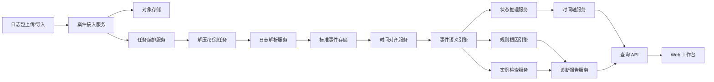
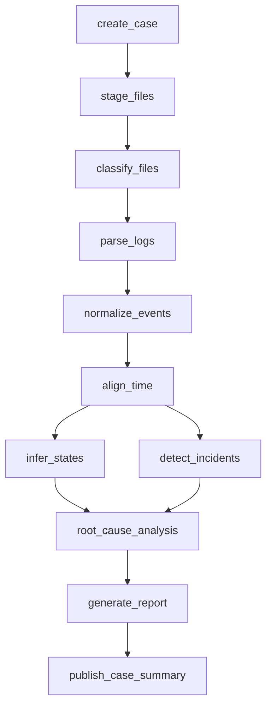

# 车端多域日志智能诊断平台技术设计文档

## 1. 文档目标

本文档定义一个可产品化落地的技术方案，面向以下目标：

- 接收车载娱乐主机、网关、TBox、MCU、ECU 等多源日志
- 对日志做结构化解析、时间对齐、事件抽取、状态推理和根因分析
- 输出统一时间轴、故障根因、责任域控和证据链
- 支持跨车型扩展和规则持续迭代

本文档覆盖：

- 模块拆分
- 系统架构
- 数据模型与表结构
- API 设计
- 异步任务流
- 落地实施建议

## 2. 设计原则

- 规则优先：事实提取和根因初判由 parser + 规则引擎完成
- 可追溯：每个结论必须可回链到原始日志文件和行号
- 可扩展：日志类型、车型信号、规则、报告模板均可插拔
- 分层解耦：采集、解析、时间对齐、推理、报告独立演进
- 批处理优先：一期先做离线分析，二期再扩展在线准实时分析

## 3. 总体架构



## 4. 模块拆分

### 4.1 Case Intake Service

职责：

- 创建案件
- 接收日志包上传
- 识别 VIN、车型、版本、采集时间范围等元信息
- 写入案件基础信息

输入：

- zip / tar.gz / 单文件目录

输出：

- `case`
- `raw_log_file`
- 初始任务记录

### 4.2 File Staging Service

职责：

- 解压日志包
- 目录归档
- MIME/扩展名识别
- 文件来源预分类

支持识别：

- Android logcat
- kernel
- tombstone / anr
- FOTA 文本日志
- DLT
- MCU
- iBDU
- 车型信号导出文件

### 4.3 Parser Service

职责：

- 针对不同日志格式做结构化解析
- 生成标准化原始事件
- 保留原始文件、行号、原始时间戳、解析置信度

建议拆成插件：

- `parser_android`
- `parser_kernel`
- `parser_fota`
- `parser_dlt`
- `parser_mcu`
- `parser_ibdu`
- `parser_vehicle_signal`

### 4.4 Event Normalizer

职责：

- 将 parser 输出转成统一事件模型
- 将模块级日志归并为语义事件
- 补充域控、ECU、事件类型、严重级别

例子：

- 原始日志：`verifyPackage: fileName ... not exist`
- 标准事件：`fota.verify.file_missing`

### 4.5 Time Alignment Service

职责：

- 统一 Android wall clock、MCU uptime、DLT 异常时间、iBDU 时间
- 为每个日志源计算时钟偏移和可信度
- 生成统一时间轴字段 `normalized_ts`

核心能力：

- 锚点事件识别
- offset 拟合
- 多源时间置信度管理

### 4.6 Semantic Event Engine

职责：

- 抽取产品级事件
- 合并重复事件
- 降噪
- 标注事件间关联

事件大类：

- 车辆状态
- 用户行为
- 座舱系统
- OTA/FOTA
- TBox/网络
- MCU/域控通信
- 电源/低功耗
- 故障诊断

### 4.7 State Inference Service

职责：

- 基于语义事件维护多个状态机
- 还原车辆状态、用户会话、座舱功能状态、网络状态、OTA 状态

输出：

- `inferred_state`
- `timeline_segment`

### 4.8 Root Cause Engine

职责：

- 对异常事件做规则匹配
- 聚合跨域证据
- 输出 Top N 根因

组成：

- 规则引擎
- 证据链构建器
- 案例检索器
- 报告摘要器

### 4.9 Query API Service

职责：

- 提供案件、时间轴、根因、原始日志、统计报表查询接口
- 供前端工作台使用

### 4.10 Report Service

职责：

- 生成 Markdown / HTML / PDF 报告
- 输出摘要、时间轴、根因、证据链、责任归属和建议

## 5. 部署架构

建议一期采用单体后端 + 异步任务队列：

- `api-server`：FastAPI
- `worker`：Celery 或 Arq
- `postgres`：结构化存储
- `opensearch`：全文检索
- `minio`：原始文件与报告存储
- `redis`：队列和缓存

二期可将 `Parser`、`Time Alignment`、`Root Cause` 独立为服务。

## 6. 逻辑数据流

### 6.1 主分析链路

1. 用户上传日志包
2. 系统创建案件并保存对象存储
3. 任务编排器发起解压和识别任务
4. 文件识别后分发到对应 parser
5. parser 生成结构化原始事件
6. 标准化服务生成语义事件
7. 时间对齐服务计算统一时间
8. 状态推理服务构建时间轴
9. 根因引擎输出 Top N 根因和证据链
10. 报告服务生成案件报告

### 6.2 查询链路

1. 前端请求案件总览
2. API 聚合案件、异常、根因、时间轴摘要
3. 用户点击某事件
4. API 返回事件详情和原始日志上下文

## 7. 标准事件模型

建议统一为如下 JSON 结构：

```json
{
  "event_id": "evt_01HXXX",
  "case_id": "case_01HXXX",
  "normalized_ts": "2025-09-11T09:01:22.600+08:00",
  "original_ts": "2025-09-11 09:01:22,600",
  "ts_source": "android_wall_clock",
  "ts_confidence": 0.98,
  "domain": "cockpit",
  "ecu": "MPU",
  "module": "FotaDownloadImpl",
  "event_type": "fota.verify.file_missing",
  "event_name": "FOTA验签文件缺失",
  "severity": "error",
  "direction": "internal",
  "attrs": {
    "file_path": "/Map/ota/fota/package/ipk/a.tar.enc",
    "upgrade_phase": "verify"
  },
  "raw_ref": {
    "file_id": "file_01HXXX",
    "path": "日志/娱乐系统日志/fota/fotalog/fota_2025-09-11.0.log",
    "line_no": 4158
  },
  "parser_name": "parser_fota",
  "parser_version": "1.0.0"
}
```

## 8. 事件字典设计

一期建议先落地以下事件类型：

- `vehicle.acc.on`
- `vehicle.ign.on`
- `vehicle.door.open`
- `vehicle.door.close`
- `vehicle.speed.change`
- `user.press.home`
- `user.press.volume_up`
- `user.voice.wakeup`
- `app.navigation.foreground`
- `system.boot.completed`
- `system.process.restart`
- `system.native.crash`
- `fota.version.check`
- `fota.download.start`
- `fota.download.complete`
- `fota.verify.file_missing`
- `fota.flash.blocked`
- `fota.upgrade.failed`
- `network.dns.resolve_failed`
- `network.mqtt.disconnect`
- `network.socket.bad_fd`
- `comm.mpu_alive_false`
- `comm.eth.port.down`
- `power.mode.invalid`
- `power.voltage.low`

## 9. 表结构设计

以下为核心表。字段以 PostgreSQL 为例。

### 9.1 `case`

```sql
CREATE TABLE case_record (
  id                  VARCHAR(64) PRIMARY KEY,
  vin                 VARCHAR(32),
  vehicle_model       VARCHAR(64),
  vehicle_platform    VARCHAR(64),
  sw_version          VARCHAR(64),
  hw_version          VARCHAR(64),
  source_name         VARCHAR(255),
  upload_user         VARCHAR(64),
  status              VARCHAR(32) NOT NULL,
  log_start_time      TIMESTAMPTZ,
  log_end_time        TIMESTAMPTZ,
  created_at          TIMESTAMPTZ NOT NULL DEFAULT NOW(),
  updated_at          TIMESTAMPTZ NOT NULL DEFAULT NOW()
);
```

### 9.2 `raw_log_file`

```sql
CREATE TABLE raw_log_file (
  id                  VARCHAR(64) PRIMARY KEY,
  case_id             VARCHAR(64) NOT NULL REFERENCES case_record(id),
  storage_path        TEXT NOT NULL,
  original_name       VARCHAR(255) NOT NULL,
  relative_path       TEXT,
  file_type           VARCHAR(64),
  domain              VARCHAR(32),
  ecu                 VARCHAR(64),
  parser_name         VARCHAR(64),
  parse_status        VARCHAR(32) NOT NULL,
  file_size           BIGINT,
  line_count          BIGINT,
  checksum            VARCHAR(128),
  started_at          TIMESTAMPTZ,
  finished_at         TIMESTAMPTZ,
  created_at          TIMESTAMPTZ NOT NULL DEFAULT NOW()
);
CREATE INDEX idx_raw_log_file_case_id ON raw_log_file(case_id);
```

### 9.3 `raw_log_line`

大文件建议按需落库，只存异常窗口和索引；也可全文写入 OpenSearch。

```sql
CREATE TABLE raw_log_line (
  id                  BIGSERIAL PRIMARY KEY,
  case_id             VARCHAR(64) NOT NULL REFERENCES case_record(id),
  file_id             VARCHAR(64) NOT NULL REFERENCES raw_log_file(id),
  line_no             INTEGER NOT NULL,
  original_ts_text    VARCHAR(128),
  content             TEXT NOT NULL
);
CREATE INDEX idx_raw_log_line_file_line ON raw_log_line(file_id, line_no);
```

### 9.4 `normalized_event`

```sql
CREATE TABLE normalized_event (
  id                  VARCHAR(64) PRIMARY KEY,
  case_id             VARCHAR(64) NOT NULL REFERENCES case_record(id),
  file_id             VARCHAR(64) REFERENCES raw_log_file(id),
  normalized_ts       TIMESTAMPTZ,
  original_ts_text    VARCHAR(128),
  ts_source           VARCHAR(64),
  ts_confidence       NUMERIC(4,3),
  domain              VARCHAR(32) NOT NULL,
  ecu                 VARCHAR(64),
  module              VARCHAR(128),
  event_type          VARCHAR(128) NOT NULL,
  event_name          VARCHAR(255),
  severity            VARCHAR(16),
  attrs               JSONB NOT NULL DEFAULT '{}'::jsonb,
  raw_line_no         INTEGER,
  parser_name         VARCHAR(64),
  parser_version      VARCHAR(32),
  created_at          TIMESTAMPTZ NOT NULL DEFAULT NOW()
);
CREATE INDEX idx_event_case_time ON normalized_event(case_id, normalized_ts);
CREATE INDEX idx_event_case_type ON normalized_event(case_id, event_type);
CREATE INDEX idx_event_attrs_gin ON normalized_event USING GIN(attrs);
```

### 9.5 `source_clock_profile`

```sql
CREATE TABLE source_clock_profile (
  id                  BIGSERIAL PRIMARY KEY,
  case_id             VARCHAR(64) NOT NULL REFERENCES case_record(id),
  file_id             VARCHAR(64) REFERENCES raw_log_file(id),
  source_name         VARCHAR(128) NOT NULL,
  clock_type          VARCHAR(64) NOT NULL,
  base_offset_ms      BIGINT,
  confidence          NUMERIC(4,3),
  anchor_count        INTEGER NOT NULL DEFAULT 0,
  details             JSONB NOT NULL DEFAULT '{}'::jsonb,
  created_at          TIMESTAMPTZ NOT NULL DEFAULT NOW(),
  updated_at          TIMESTAMPTZ NOT NULL DEFAULT NOW()
);
```

### 9.6 `inferred_state`

```sql
CREATE TABLE inferred_state (
  id                  BIGSERIAL PRIMARY KEY,
  case_id             VARCHAR(64) NOT NULL REFERENCES case_record(id),
  ts                  TIMESTAMPTZ,
  state_domain        VARCHAR(64) NOT NULL,
  state_name          VARCHAR(128) NOT NULL,
  state_value         VARCHAR(128) NOT NULL,
  confidence          NUMERIC(4,3),
  evidence_event_ids  JSONB NOT NULL DEFAULT '[]'::jsonb,
  created_at          TIMESTAMPTZ NOT NULL DEFAULT NOW()
);
CREATE INDEX idx_state_case_time ON inferred_state(case_id, ts);
```

### 9.7 `incident`

```sql
CREATE TABLE incident (
  id                  VARCHAR(64) PRIMARY KEY,
  case_id             VARCHAR(64) NOT NULL REFERENCES case_record(id),
  incident_type       VARCHAR(128) NOT NULL,
  title               VARCHAR(255) NOT NULL,
  severity            VARCHAR(16),
  start_ts            TIMESTAMPTZ,
  end_ts              TIMESTAMPTZ,
  confidence          NUMERIC(4,3),
  summary             TEXT,
  evidence_event_ids  JSONB NOT NULL DEFAULT '[]'::jsonb,
  created_at          TIMESTAMPTZ NOT NULL DEFAULT NOW()
);
CREATE INDEX idx_incident_case_type ON incident(case_id, incident_type);
```

### 9.8 `root_cause_result`

```sql
CREATE TABLE root_cause_result (
  id                  BIGSERIAL PRIMARY KEY,
  case_id             VARCHAR(64) NOT NULL REFERENCES case_record(id),
  rank_no             INTEGER NOT NULL,
  cause_code          VARCHAR(128) NOT NULL,
  cause_title         VARCHAR(255) NOT NULL,
  owner_domain        VARCHAR(64),
  owner_module        VARCHAR(128),
  confidence          NUMERIC(4,3),
  evidence_event_ids  JSONB NOT NULL DEFAULT '[]'::jsonb,
  rationale           TEXT,
  suggestions         JSONB NOT NULL DEFAULT '[]'::jsonb,
  created_at          TIMESTAMPTZ NOT NULL DEFAULT NOW()
);
CREATE INDEX idx_root_cause_case_rank ON root_cause_result(case_id, rank_no);
```

### 9.9 `analysis_task`

```sql
CREATE TABLE analysis_task (
  id                  VARCHAR(64) PRIMARY KEY,
  case_id             VARCHAR(64) NOT NULL REFERENCES case_record(id),
  task_type           VARCHAR(64) NOT NULL,
  task_status         VARCHAR(32) NOT NULL,
  retry_count         INTEGER NOT NULL DEFAULT 0,
  payload             JSONB NOT NULL DEFAULT '{}'::jsonb,
  result              JSONB NOT NULL DEFAULT '{}'::jsonb,
  error_message       TEXT,
  started_at          TIMESTAMPTZ,
  finished_at         TIMESTAMPTZ,
  created_at          TIMESTAMPTZ NOT NULL DEFAULT NOW()
);
CREATE INDEX idx_task_case_type ON analysis_task(case_id, task_type);
```

## 10. API 设计

### 10.1 案件与上传

#### `POST /api/v1/cases`

创建案件。

请求：

```json
{
  "vin": "LSFJM11C0SA119437",
  "vehicleModel": "XXX EV",
  "swVersion": "4B0102",
  "sourceName": "售后手动导入"
}
```

响应：

```json
{
  "caseId": "case_01HXXX",
  "status": "CREATED"
}
```

#### `POST /api/v1/cases/{caseId}/files`

上传日志包或单个日志文件。可采用分片上传或预签名 URL。

响应：

```json
{
  "fileId": "file_01HXXX",
  "uploadUrl": "https://..."
}
```

#### `POST /api/v1/cases/{caseId}/analyze`

触发分析。

请求：

```json
{
  "profile": "default",
  "reparse": false,
  "generateReport": true
}
```

响应：

```json
{
  "taskId": "task_01HXXX",
  "status": "QUEUED"
}
```

### 10.2 查询接口

#### `GET /api/v1/cases/{caseId}`

返回案件总览。

响应字段：

- 基础信息
- 日志覆盖率
- 时间范围
- 顶层根因
- 异常统计

#### `GET /api/v1/cases/{caseId}/timeline`

查询统一时间轴。

参数：

- `start`
- `end`
- `domains`
- `eventTypes`
- `severity`
- `page`
- `pageSize`

响应：

```json
{
  "items": [
    {
      "eventId": "evt_01",
      "ts": "2025-09-11T09:01:22.600+08:00",
      "domain": "cockpit",
      "eventType": "fota.verify.file_missing",
      "title": "FOTA验签文件缺失",
      "severity": "error",
      "confidence": 0.98
    }
  ],
  "total": 1
}
```

#### `GET /api/v1/cases/{caseId}/timeline/summary`

返回时间轴摘要，用于页面首屏：

- 车辆状态段
- 用户行为段
- 故障段
- 高风险时段

#### `GET /api/v1/cases/{caseId}/root-causes`

返回根因排序。

响应：

```json
{
  "items": [
    {
      "rank": 1,
      "causeCode": "fota.local_file_state_inconsistent",
      "title": "FOTA本地文件与状态不一致",
      "ownerDomain": "cockpit",
      "ownerModule": "FotaDownloadImpl/FotaFlashImpl",
      "confidence": 0.92,
      "evidenceEventIds": ["evt_1", "evt_2"]
    }
  ]
}
```

#### `GET /api/v1/cases/{caseId}/incidents`

按故障实例返回结果，例如：

- OTA 失败实例
- 网络断链实例
- 主机重启实例

#### `GET /api/v1/events/{eventId}`

返回事件详情。

包含：

- 标准事件
- 属性
- 关联事件
- 原始日志引用

#### `GET /api/v1/files/{fileId}/context?lineNo=4158&before=20&after=20`

返回指定原始日志上下文。

### 10.3 报告接口

#### `POST /api/v1/cases/{caseId}/reports`

生成报告。

请求：

```json
{
  "format": "markdown",
  "template": "technical_diagnosis"
}
```

#### `GET /api/v1/cases/{caseId}/reports/latest`

返回最新报告下载地址。

## 11. 任务流设计

### 11.1 任务状态

- `QUEUED`
- `RUNNING`
- `SUCCESS`
- `FAILED`
- `PARTIAL_SUCCESS`
- `CANCELLED`

### 11.2 编排 DAG



### 11.3 任务明细

#### `stage_files`

输入：

- case_id
- uploaded file ids

输出：

- 解压后的文件清单
- 文件 hash
- 预分类结果

#### `parse_logs`

策略：

- 按文件类型分桶
- 同类型文件并行解析
- 单文件失败不阻塞全案

输出：

- `raw_log_file.parse_status`
- `normalized_event` 的原始版本

#### `align_time`

输入：

- 所有标准事件

输出：

- `source_clock_profile`
- `normalized_event.normalized_ts`

失败兜底：

- 保留原始时间
- 设置低置信度

#### `infer_states`

输入：

- 时间对齐后的事件流

输出：

- `inferred_state`
- `timeline_segment`

#### `root_cause_analysis`

输入：

- 异常事件
- 状态变化
- 历史案例

输出：

- `incident`
- `root_cause_result`

#### `generate_report`

输出：

- Markdown
- HTML
- PDF

## 12. 规则引擎设计

规则分 3 层：

### 12.1 事件规则

将原始日志映射成语义事件。

例：

- 匹配 `verifyPackage: .* not exist`
- 产生 `fota.verify.file_missing`

### 12.2 诊断规则

根据事件组合产生 incident。

例：

- `fota.download.complete`
- 后续 10 分钟内出现 `fota.verify.file_missing`
- 产生 `incident_type = fota_file_inconsistent`

### 12.3 根因规则

将多个 incident 聚合成根因候选。

例：

- 多次 `fota.verify.file_missing`
- 伴随 `fota.upgraded_flag_exist`
- 最终 `fota.upgrade.failed`
- 根因：`fota.local_file_state_inconsistent`

建议规则存储：

- YAML 或 JSON
- 支持热更新
- 规则版本化

## 13. 案例检索设计

目标：

- 对历史案件建立向量索引
- 支持相似模式召回

输入特征：

- 事件序列
- 事件频次
- 根因标签
- 车型/版本

输出：

- 相似案件列表
- 相似原因
- 置信度参考

一期可不做在线学习，只做静态案例库。

## 14. 权限与安全

角色建议：

- `admin`
- `rd_engineer`
- `test_engineer`
- `after_sales`
- `viewer`

安全要求：

- 日志包加密存储
- 支持 VIN 脱敏
- 支持用户行为字段脱敏
- 操作审计
- 报告导出权限控制

## 15. 可观测性

需监控：

- 单案件总耗时
- 单文件解析成功率
- 时间对齐成功率
- 根因规则命中率
- 报告生成成功率
- worker 队列积压

建议指标：

- `case_analysis_duration_seconds`
- `parser_success_total`
- `parser_failure_total`
- `event_generated_total`
- `timeline_alignment_confidence_avg`
- `root_cause_hit_total`

## 16. 性能目标

一期目标：

- 1GB 日志包，30 分钟内完成全量分析
- 1000 万行级别案件可分页查询
- 时间轴接口 P95 < 2 秒
- 案件总览接口 P95 < 1 秒

优化策略：

- 解析阶段并行
- 原始日志全文进 OpenSearch
- 标准事件走 PostgreSQL
- 热门摘要走 Redis 缓存

## 17. 技术选型建议

- 后端：Python + FastAPI
- 任务队列：Celery 或 Arq
- 数据库：PostgreSQL
- 全文检索：OpenSearch
- 对象存储：MinIO / S3
- 缓存：Redis
- 前端：React + TypeScript
- 报告渲染：Markdown + HTML + PDF

## 18. 版本规划

### Phase 1

- 案件上传
- 多日志解析
- 统一事件模型
- 时间轴查询
- FOTA/网络/主机稳定性根因分析
- 自动报告

### Phase 2

- 车型信号映射
- 车辆行为时间轴增强
- 历史案例检索
- 用户行为识别增强

### Phase 3

- 在线分析
- 跨车型知识库
- 自然语言问答
- 趋势统计和质量看板

## 19. 当前仓库落地建议

基于当前仓库已有能力：

- 保留 `log_analyzer/` 作为 parser 原型层
- 新增 `app/` 或 `platform/` 目录承载产品化代码
- 将现有 `parse_log_file`、`fota_stage`、`exception_extractor` 抽成独立解析插件
- 先做离线任务编排，再补查询 API 和前端

建议目录：

```text
AI_Diagnosis/
├── app/
│   ├── api/
│   ├── core/
│   ├── models/
│   ├── services/
│   ├── parsers/
│   ├── rules/
│   ├── workers/
│   └── reports/
├── log_analyzer/
├── 技术设计文档.md
└── 日志/
```

## 20. 结论

该方案一期即可支持：

- 多域日志接入
- OTA/网络/主机类故障定位
- 部分车辆与用户行为还原
- 统一时间轴和可解释证据链

要达到稳定的“完整车辆行为重建”，需要二期引入车型信号映射和整车状态日志。
