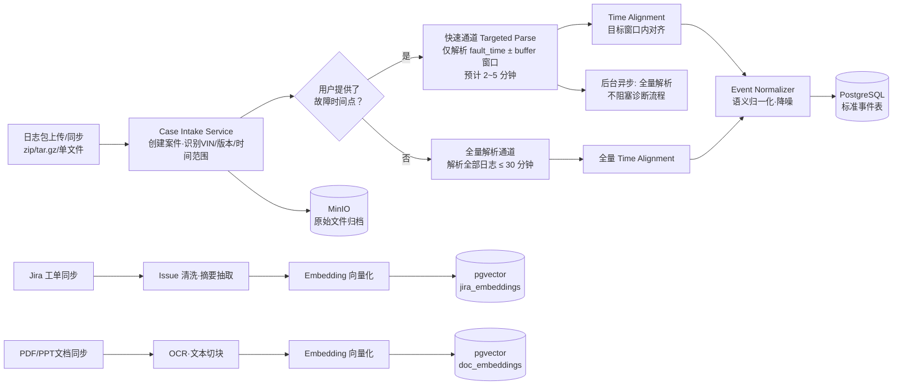
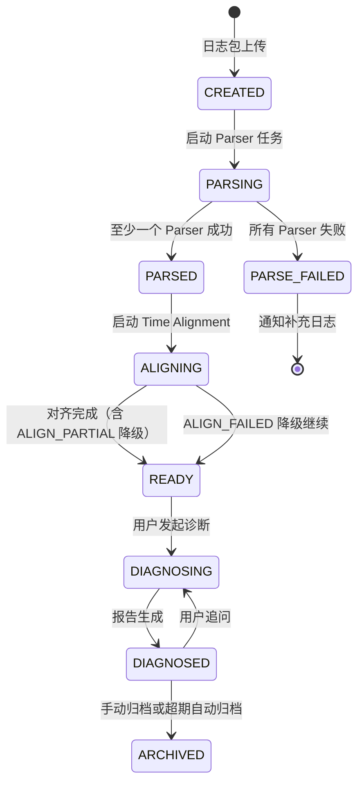
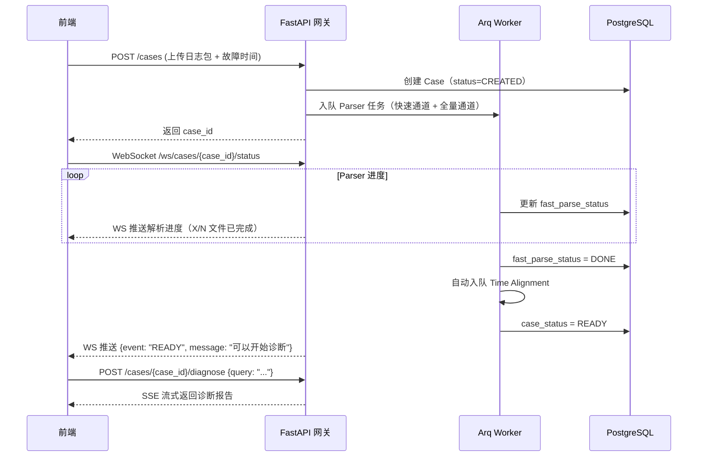
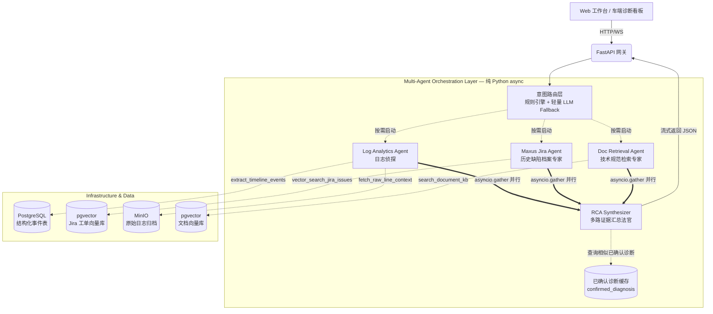
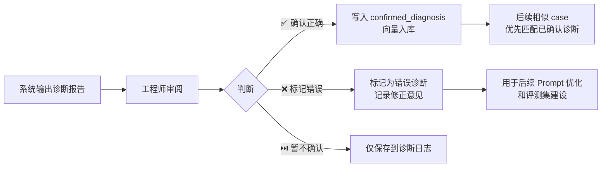
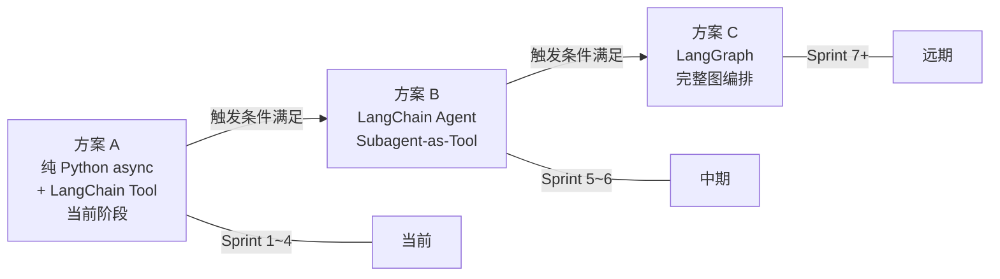

# FOTA 多域日志智能诊断系统可行性方案（修订版 v6）

> **修订说明**：本版本在 v5 系统设计方案基础上，整合可行性分析讨论结果，新增以下关键改动：
>
> 1. **时间窗口前置裁剪** — 离线解析前先确定故障时间范围，避免全量 1GB 解析等待（第 2 节）
> 2. **编排框架重新评估** — 以纯 Python async 替代 LangGraph，降低框架耦合风险（第 3、6 节）
> 3. **分层长期记忆 + 反馈闭环** — 确保同产品诊断结论一致性（第 7 节）
> 4. **模型选型明确化** — Claude 主力 + OpenAI Fallback 双供应商策略（第 4 节）
> 5. **Router 层双级 Fallback** — 规则引擎 + 轻量 LLM，意图识别 < 500ms（第 5 节）
> 6. **LLM 429 限流五层防御** — 详见独立文档 `LLM_429限流防御方案.md`（第 10 节引用）

---

## 1. 总体概述

本方案旨在构建一套面向 FOTA 等复杂软硬协同故障的**多智能体（Multi-Agent）根因分析诊断系统**。

系统以外挂知识库检索（RAG）和自主工具调用（Tool Use）为基础，采用 **纯 Python 异步编排**（详见第 6 节论证）进行核心流转。将庞大的原始日志数据池、历史缺陷案底工单库（Jira）以及官方系统设计规范（Document）三大数据源引入大模型的推理边界，实现全程可交叉回溯、**高置信度、高度自动化**的故障推测与诊断（低置信度情形下会标记人工复核标志，详见第 9 节）。

系统分为两大阶段：

1. **离线预处理阶段**：日志解析（支持时间窗口裁剪快速通道）、时间对齐、事件归一化、向量入库（详见第 2 节）。
2. **在线诊断阶段**：用户提问 → 规则引擎/轻量LLM 意图路由 → 多 Agent 并行分析 → RCA Synthesizer 汇总 → 报告输出（详见第 3 节）。

---

## 2. 离线数据预处理管线

### 2.1 管线总览（含时间窗口裁剪改进）

> **v6 改进**：原方案全量解析 1GB 日志需 30 分钟。实际故障排查场景中，故障发生时间通常已知。新增两级解析策略：快速通道仅解析目标时间窗口，后台异步完成全量解析。



### 2.2 时间窗口裁剪策略（v6 新增）

| 参数 | 说明 | 默认值 |
|---|---|---|
| `fault_time` | 故障发生时间点 | 用户明确提供，或 AI 从问题描述中抽取 |
| `time_buffer` | 故障时间前后缓冲窗口 | ± 15 分钟（可配置） |
| `parse_window` | 实际解析的时间范围 | `[fault_time - buffer, fault_time + buffer]` |

**时间窗口来源优先级**：
1. 用户上传时明确指定的时间点/时间range（最高优先）
2. Router 层从用户问题中通过规则/AI 抽取的时间描述
3. 均无时间信息 → 回退到全量解析

**快速通道实现**：
- Parser 插件按行扫描时，对比行首时间戳与 `parse_window`，窗口外的行直接跳过
- 大部分日志格式行首即为时间戳，判断成本极低（纯字符串比较，无需解析全行）
- 跳过的行仅记录行号范围，不做任何解析处理

**预估性能提升**：

| 场景 | 原方案耗时 | v6 快速通道耗时 | 提升 |
|---|---|---|---|
| 1GB 日志，故障窗口 ±15min | 30 分钟 | 2~5 分钟 | **6~15x** |
| 500MB 日志，故障窗口 ±30min | 15 分钟 | 3~8 分钟 | **2~5x** |

### 2.3 Parser Service 插件列表

支持以下日志格式，每种格式对应独立可插拔解析器：

| 插件名 | 日志类型 |
|---|---|
| `parser_android` | Android logcat |
| `parser_kernel` | kernel / tombstone / ANR |
| `parser_fota` | FOTA 文本日志 |
| `parser_dlt` | DLT 格式 |
| `parser_mcu` | MCU 日志 |
| `parser_ibdu` | iBDU 日志 |
| `parser_vehicle_signal` | 车型信号导出文件 |

### 2.3.1 Parser Service 并发解析策略

针对大规模日志包（>= 1GB）的处理，Parser Service 采用并发解析：

- **任务分片**：Case Intake Service 在解压后，按文件粒度将每个日志文件作为独立 Arq 任务投入队列，各 Parser 插件并行消费。
- **Worker 配置**：生产环境建议每台 Worker Pod 分配 4~8 核，Kubernetes HPA 根据队列积压自动扩缩容（目标队列长度 < 50）。
- **顺序依赖保障**：Parser 任务之间无顺序依赖，可完全并行；Time Alignment Service 必须等待同一案件所有 Parser 任务完成后再启动。实现方式：应用层在 Redis 中维护 `{case_id}_pending_parsers` 计数器，每个 Parser 完成后递减，降到 0 时自动 enqueue Time Alignment 任务（Arq 本身不提供原生 DAG 依赖链，需应用层 callback 实现）。
- **大文件分块**：单文件超过 200MB 时，Parser 内部按行数分块（默认 100 万行/块）并行处理，合并后写入标准事件表。

### 2.4 Time Alignment Service（时间对齐）

车端多域日志存在异构时钟问题（Android wall clock、MCU uptime、DLT 异常时间、iBDU 时间各自独立），必须在进入 Agent 分析前完成统一。

核心能力：

- **锚点事件识别**：在多个日志源中找到同一物理事件的时间戳，作为对齐基准。
- **Offset 拟合**：为每个日志源计算时钟偏移量（`clock_offset`）和可信度（`confidence`）。
- **`normalized_ts` 生成**：所有事件统一转换为绝对时间戳字段 `normalized_ts`。

**时间对齐失败三级降级策略**：

| 级别 | 条件 | 处理 |
|---|---|---|
| ✅ 正常 | 所有域 `clock_confidence` >= 0.8 | 正常进入 Agent 分析 |
| ⚠️ 部分降级 | 部分域 `clock_confidence` < 0.8 | 继续分析，涉及该域的时序结论加警告标签，案件标记 `ALIGN_PARTIAL` |
| 🔴 全部失败 | 无法找到跨域锚点事件 | 降级为「使用各域原始时间戳」模式，标记 `ALIGN_FAILED`，报告顶部加醒目警告：`⚠️ 时间对齐失败，时序结论不可信，仅供参考`。通过告警通道通知工程师补充日志 |

### 2.5 标准事件表 Schema

三个 Agent 查询的核心数据源，Parser 输出、Time Alignment 写入、Agent Tool 读取的统一格式：

```sql
CREATE TABLE diagnosis_events (
    id BIGINT GENERATED ALWAYS AS IDENTITY PRIMARY KEY,

    -- 归属
    case_id VARCHAR(64) NOT NULL,
    file_id VARCHAR(128) NOT NULL,          -- 原始文件标识（MinIO key）
    source_type VARCHAR(32) NOT NULL,       -- parser 类型：android / kernel / fota / dlt / mcu / ibdu / vehicle_signal

    -- 时间
    original_ts TIMESTAMPTZ,                -- 原始时间戳（各域自身时钟）
    normalized_ts TIMESTAMPTZ,              -- 对齐后统一时间戳（Time Alignment 写入）
    clock_offset_ms BIGINT DEFAULT 0,       -- 时钟偏移量（毫秒）
    clock_confidence FLOAT DEFAULT 1.0,     -- 对齐置信度（0~1）

    -- 事件内容
    event_type VARCHAR(64),                 -- 归一化事件类型：fota_stage_change / crash / error / warning / info / ...
    severity VARCHAR(16) DEFAULT 'info',    -- critical / error / warning / info / debug
    module VARCHAR(64),                     -- 所属模块：FOTA / Connectivity / MCU / ...
    message TEXT,                           -- 归一化事件描述
    raw_line_number INT,                    -- 对应原始日志行号（用于 fetch_raw_line_context 回源）
    parsed_fields JSONB DEFAULT '{}',       -- 结构化解析字段（因日志类型而异）

    -- 索引
    created_at TIMESTAMPTZ DEFAULT NOW()
);

-- 核心查询索引
CREATE INDEX idx_events_case_time ON diagnosis_events (case_id, normalized_ts);
CREATE INDEX idx_events_case_module ON diagnosis_events (case_id, module, event_type);
CREATE INDEX idx_events_case_severity ON diagnosis_events (case_id, severity) WHERE severity IN ('critical', 'error');
```

### 2.6 Case 生命周期状态机

每个诊断案件（Case）从创建到归档经历以下状态流转：



**快速通道与全量通道的状态并存**：

| 通道 | 状态字段 | 说明 |
|---|---|---|
| 快速通道 | `fast_parse_status` | PENDING → RUNNING → DONE / FAILED |
| 全量通道 | `full_parse_status` | PENDING → RUNNING → DONE / FAILED |
| Case 整体 | `case_status` | 当 `fast_parse_status = DONE` 时 Case 即进入 READY，无需等全量通道 |

### 2.7 离线→在线衔接机制

离线解析完成后，系统如何通知前端「可以开始诊断了」：



**关键设计**：
- 使用 **WebSocket** 推送 Case 状态变更（不是轮询）
- 使用 **SSE（Server-Sent Events）** 流式返回诊断报告（比 WebSocket 更适合单向流式响应）
- 快速通道完成即标记 READY，用户无需等待全量解析

### 2.8 RAG 知识库版本管理

当 Jira 工单更新或 PDF 文档重新上传时，需要处理 embedding 版本问题：

| 数据源 | 更新策略 | 实现 |
|---|---|---|
| Jira 工单 | **增量同步** — 按 `updated_at` 增量拉取变更工单 | 旧 embedding 覆盖写入（同一 issue_id），删除的工单标记 `is_deleted=true` |
| PDF/PPT 文档 | **全量重建** — 文档变更时整份重新切块和向量化 | 按 `doc_id + version` 写入新版本，旧版本标记为 `superseded`，检索时 WHERE `is_latest = true` |
| confirmed_diagnosis | **仅追加** — 已确认就不再修改 | 如需撤销，标记 `revoked = true`，不删除（保留审计轨迹） |

---

## 3. 核心架构拓扑图（在线诊断）

编排框架采用纯 Python async，详细论证见第 6 节。



### 3.1 前后端 API 契约（核心接口）

| 接口 | 方法 | 说明 | 请求/响应 |
|---|---|---|---|
| `/api/cases` | POST | 上传日志包，创建 Case | Request: `multipart/form-data` (files + fault_time + vehicle_model)；Response: `{case_id, status}` |
| `/ws/cases/{case_id}/status` | WebSocket | 订阅 Case 状态变更和解析进度 | Server → Client: `{event, progress, message}` |
| `/api/cases/{case_id}/diagnose` | POST | 发起诊断（Case 必须为 READY 状态） | Request: `{query, session_id?}`；Response: SSE 流式 `{chunk_type, content}` |
| `/api/cases/{case_id}/sessions/{session_id}/feedback` | POST | 工程师确认/标记错误 | Request: `{action: confirm|reject|skip, comment?}` |
| `/api/cases/{case_id}/report` | GET | 获取最新诊断报告（含引用） | Response: `{summary, root_cause, confidence, citations[], ...}` |
| `/api/cases/{case_id}/timeline` | GET | 时间轴事件列表（分页） | Query: `module, severity, time_range, page, page_size` |

**流式诊断响应格式（SSE）**：

```
event: agent_start
data: {"agent": "log", "status": "running"}

event: agent_done
data: {"agent": "log", "evidence_count": 12}

event: agent_done
data: {"agent": "jira", "evidence_count": 3}

event: synthesis_chunk
data: {"content": "根据日志分析..."}

event: synthesis_chunk
data: {"content": "结合 Jira 历史工单..."}

event: done
data: {"confidence": 0.87, "citations": [...]}
```

---

## 4. 模型选型策略

### 4.1 双供应商策略：Claude 主力 + OpenAI Fallback

Claude 在长上下文忠实度和 Tool Use 稳定性上于日志分析场景有优势，作为主力供应商；OpenAI 作为 Fallback 和 Embedding 供应商。

| 系统层级 | 需求特征 | 主力（Claude） | Fallback（OpenAI） |
|---|---|---|---|
| **意图路由** | 极快、便宜、分类准确 | Claude Haiku 4.5 | GPT-5.4-nano |
| **三个 Agent** | 长上下文、Tool Use、结构化输出 | Claude Sonnet 4.6（1M token 上下文） | GPT-5.4-mini（1M token） |
| **RCA Synthesizer** | 深度推理、交叉验证 | Claude Sonnet 4.6 / Opus 4.6 | GPT-5.4 |
| **Embedding** | 高质量文本向量化 | — | text-embedding-3-large（3072 维） |

### 4.2 统一抽象层

所有 LLM 调用通过统一接口层，配置化切换，业务代码不感知供应商差异：

```python
# 抽象接口
class LLMProvider(Protocol):
    async def chat(self, messages: list[dict], tools: list[dict] | None) -> ChatResponse: ...
    async def embed(self, texts: list[str]) -> list[list[float]]: ...

# 具体实现
class ClaudeProvider(LLMProvider): ...
class OpenAIProvider(LLMProvider): ...

# 配置化选择
llm_config = {
    "router": {"primary": "claude-haiku-4.5", "fallback": "gpt-5.4-nano"},
    "agents": {"primary": "claude-sonnet-4.6", "fallback": "gpt-5.4-mini"},
    "synthesizer": {"primary": "claude-sonnet-4.6", "fallback": "gpt-5.4"},
    "embedding": {"model": "text-embedding-3-large"},
}
```

### 4.3 数据安全与合规

车端日志可能涉及车辆 VIN（可关联车主）、地理位置、控制器固件版本等敏感信息。需考虑：

| 措施 | 说明 |
|---|---|
| **日志脱敏** | Parser 阶段将 VIN 替换为匿名 Case ID，GPS 坐标剥离 |
| **只送摘要** | Agent Tool 在本地查询日志，只将查询结果（事件摘要 + 代码片段）送 LLM，不送原始日志全文 |
| **API 通道** | 优先通过 AWS Bedrock（Claude）/ Azure OpenAI（GPT）的企业级通道调用，合规性更有保障 |
| **数据出境评估** | 需法务确认车端日志（脱敏后）是否可通过海外 API 处理，或是否需要部署在特定区域 |

---

## 5. 意图路由层设计

原始方案 Router 全部走 LLM，响应偏慢。采用规则引擎 + 轻量 LLM 双级 Fallback，大部分常见意图 < 10ms 完成路由。

### 5.1 双级路由架构

```
用户提问
  │
  ├─ 第 1 关：规则引擎（< 10ms）
  │   关键词/正则匹配 → 直接路由
  │   命中 → 跳过 LLM，直接派发 Agent
  │
  └─ 未命中 → 第 2 关：轻量 LLM（< 500ms）
      Claude Haiku 4.5 / GPT-5.4-nano
      复杂/模糊意图才走 LLM 路由
```

### 5.2 规则引擎路由表

```python
RULE_BASED_ROUTES = [
    # (匹配模式, 激活的 Agent 组合)
    (r"(OTA|FOTA|升级|刷写|回滚).*(失败|异常|卡住|超时)", ["log", "jira"]),
    (r"(崩溃|tombstone|ANR|挂死|重启)", ["log", "jira"]),
    (r"(CRC|校验|MD5|SHA).*(失败|不一致|错误)", ["log", "jira"]),
    (r"(状态机|阶段跳转|download|verify|install).*(异常|跳过|缺失)", ["log", "doc"]),
    (r"(规范|设计|预期行为|应该|正常流程)", ["doc"]),
    (r"(历史|有没有过|之前|类似|相似问题)", ["jira"]),
    (r"(根因|原因|为什么|全面分析|综合诊断)", ["log", "jira", "doc"]),
]

# 同时抽取时间窗口（用于快速解析通道）
TIME_PATTERNS = [
    r"(\d{4}-\d{2}-\d{2}\s+\d{2}:\d{2}(:\d{2})?)",  # 2025-03-15 14:02
    r"(\d{2}:\d{2}(:\d{2})?)",                         # 14:02
    r"(今天|昨天|上午|下午)\s*(\d{1,2}[点时]\d{0,2})",   # 今天下午2点
]
```

### 5.3 LLM Router 输出格式

当规则引擎未命中时，调用轻量 LLM，Prompt 极简化（只给问题 + 合法选项）：

```json
{
    "active_agents": ["log", "jira", "doc"],
    "extracted_fault_time": "2025-03-15T14:02:00",
    "time_buffer_minutes": 15,
    "extracted_entities": {
        "vin": "LSJA24U6...",
        "module": "FOTA",
        "keywords": ["下载失败", "CRC"]
    }
}
```

- `active_agents` 中每个元素必须是 `"log" | "jira" | "doc"` 之一
- `extracted_fault_time` 和 `time_buffer_minutes` 用于驱动快速解析通道

---

## 6. 编排框架选型论证（v6 重大变更）

### 6.1 为什么不用 LangGraph

原方案 v1~v5 在修订记录中暴露的问题：

| 版本 | 修复内容 |
|---|---|
| v2 | `add_edge` 不支持真并行，改 `Send` API |
| v3 | `Send` 后 fan-in 写法不对；`PostgresSaver` 改 `AsyncPostgresSaver` |
| v4 | 再次补充 fan-in 显式声明说明 |

**5 个版本里有 3 次在修 LangGraph 的 API 用法**，说明：
1. LangGraph API 在活跃变动期，每次升级可能需要改编排代码
2. 团队需要学习框架特有的 State/Reducer/Send/Checkpoint 概念
3. Debug 时需要穿透框架层才能看到实际行为

### 6.2 本系统的编排复杂度评估

本系统的编排模式核心是：

```
Router → 并行扇出 N 个 Agent → 等待全部完成 → Synthesizer 汇总
```

这是一个**固定拓扑、无环、无多轮人机交互**的简单 DAG。LangGraph 的核心价值——复杂有环状态机、多轮 human-in-the-loop、断点续跑——在这个场景里大多用不到。

### 6.3 当前方案（方案 A）：纯 Python async + LangChain Tool 抽象

```python
import asyncio
from dataclasses import dataclass, field

@dataclass
class DiagnosisState:
    """诊断会话状态（替代 LangGraph TypedDict State）"""
    original_query: str
    case_id: str
    active_agents: list[str] = field(default_factory=list)
    fault_time: str | None = None
    time_buffer_minutes: int = 15
    
    # Agent 输出（asyncio.gather 为协程并发/单线程，list 追加安全，无需 Reducer）
    log_evidence: list[dict] = field(default_factory=list)
    jira_references: list[dict] = field(default_factory=list)
    doc_rules: list[dict] = field(default_factory=list)
    
    final_diagnosis: str | None = None
    confidence: float | None = None

async def run_diagnosis(query: str, case_id: str) -> DiagnosisState:
    state = DiagnosisState(original_query=query, case_id=case_id)
    
    # 1. 意图路由（规则引擎 + LLM fallback）
    route_result = await route_query(state)
    state.active_agents = route_result.active_agents
    state.fault_time = route_result.fault_time
    
    # 2. 并行扇出 Agent（asyncio.gather + 单 Agent 超时保护）
    AGENT_TIMEOUT = 60  # 单个 Agent 最大执行时间（秒），含内部所有 LLM + Tool 调用
    
    agent_tasks = []
    if "log" in state.active_agents:
        agent_tasks.append(asyncio.wait_for(run_log_agent(state), timeout=AGENT_TIMEOUT))
    if "jira" in state.active_agents:
        agent_tasks.append(asyncio.wait_for(run_jira_agent(state), timeout=AGENT_TIMEOUT))
    if "doc" in state.active_agents:
        agent_tasks.append(asyncio.wait_for(run_doc_agent(state), timeout=AGENT_TIMEOUT))
    
    agent_results = await asyncio.gather(*agent_tasks, return_exceptions=True)
    
    # 3. 合并结果到 State
    for i, result in enumerate(agent_results):
        if isinstance(result, asyncio.TimeoutError):
            logger.warning(f"Agent timeout after {AGENT_TIMEOUT}s: {state.active_agents[i]}")
            continue  # 超时的 Agent 跳过，其余证据继续汇总
        if isinstance(result, Exception):
            logger.error(f"Agent error: {result}")
            continue  # 异常的 Agent 跳过，不阻断整体诊断
        merge_agent_result(state, result)
    
    # 4. RCA Synthesizer 汇总
    state.final_diagnosis = await run_synthesizer(state)
    
    # 5. 置信度计算（纯代码逻辑）
    state.confidence = calculate_confidence(state)
    
    # 6. 引用 ID 验证（防幻觉断言）
    verify_citations(state)
    
    return state
```

### 6.4 三套方案对比总结

| 维度 | 方案 A：纯 Python async（当前） | 方案 B：LangChain Agent | 方案 C：LangGraph |
|---|---|---|---|
| 编排复杂度 | 简单 DAG ✅（本项目够用） | 简单 Agent 链 ✅ | 复杂有环图、多轮交互 ✅ |
| 并发支持 | `asyncio.gather` 原生并行 ✅ | Subagent-as-Tool 本质串行 ⚠️ | `Send` API 并行扇出 ✅ |
| API 稳定性 | Python asyncio 极稳定 ✅ | 趋于稳定（经历过大重构） ⚠️ | 仍在活跃变动 ❌ |
| 学习门槛 | 极低（async/await 即可） | 低（create_agent 一行创建） | 较高（State/Reducer/Send/Checkpoint） |
| 调试难度 | 直接 print/断点 | 较好 | 需穿透框架层 |
| 流程可控性 | 完全可控（代码即流程） | LLM 驱动决策，不完全可控 ⚠️ | 完全可控（图即流程） ✅ |
| 内置 Checkpoint | 无（需自建，但一次诊断 < 5 分钟，可能不需要） | 依赖 LangGraph | 原生支持 ✅ |
| Human-in-the-Loop | 需自建 | 基础支持 | 原生支持 ✅ |
| 可视化 Studio | 无（可通过 Agent 状态推送实现等效 UI） | 无 | LangGraph Studio ✅ |
| 代码量 | ~100~150 行 | ~50~80 行 | ~200 行 + 框架配置 |
| **适用阶段** | **Sprint 1~4（当前）** | **Sprint 5+（如需简化代码）** | **长期演进（如需复杂工作流）** |

**当前结论**：采用**方案 A**（纯 Python async 编排 + LangChain Tool/Chat 抽象），在 Sprint 1~4 阶段提供最大的稳定性和可控性。方案 B 和方案 C 作为未来演进选项，详见第 14 节。

---

## 7. 分层长期记忆与反馈闭环（v6 新增）

### 7.1 问题背景

当前方案缺少诊断会话记忆。同款车型 + 同症状可能因 Jira 工单尚未创建而得到不一致的诊断结论。

### 7.2 三层记忆架构

```
┌──────────────────────────────────────────────────────────┐
│  第 1 层：Jira 知识库（已有）                               │
│  人工审核过的历史缺陷，最高可信度                              │
│  来源：pgvector jira_embeddings 表                        │
├──────────────────────────────────────────────────────────┤
│  第 2 层：已确认诊断缓存（v6 新增）                           │
│  存储：{车型, 症状摘要, 根因结论, 确认状态, 确认人, 时间}        │
│  准入：工程师点击「确认诊断正确」后才入库                       │
│  检索：后续相似 case 优先匹配此层，命中后直接引用               │
│  来源：pgvector confirmed_diagnosis_embeddings 表          │
├──────────────────────────────────────────────────────────┤
│  第 3 层：原始诊断日志（v6 新增，低优先级）                    │
│  所有会话的 input/output 归档，不直接参与实时检索               │
│  用途：批量评测、模型调优、审计追溯                            │
│  来源：PostgreSQL diagnosis_sessions 表                    │
└──────────────────────────────────────────────────────────┘
```

### 7.3 反馈闭环流程



### 7.4 已确认诊断表结构

```sql
CREATE TABLE confirmed_diagnosis (
    id UUID PRIMARY KEY DEFAULT gen_random_uuid(),
    
    -- 诊断身份
    case_id VARCHAR(64) NOT NULL,
    vehicle_model VARCHAR(32),              -- 车型（如 V71, V90）
    fault_module VARCHAR(64),               -- 故障模块（如 FOTA, Connectivity）
    
    -- 诊断内容
    symptom_summary TEXT NOT NULL,           -- 症状摘要
    root_cause TEXT NOT NULL,               -- 根因结论
    resolution TEXT,                         -- 修复方案
    symptom_embedding vector(1536),          -- 症状摘要的向量（用于语义匹配）
    
    -- 确认信息
    confirmed_by VARCHAR(64) NOT NULL,      -- 确认工程师
    confirmed_at TIMESTAMPTZ DEFAULT NOW(),
    confidence_override FLOAT              -- 工程师手动调整的置信度
);

-- HNSW 向量索引（单独创建）
CREATE INDEX idx_confirmed_diag_embedding
    ON confirmed_diagnosis
    USING hnsw (symptom_embedding vector_cosine_ops);
```

### 7.5 Synthesizer 引用已确认诊断的逻辑

```python
async def run_synthesizer(state: DiagnosisState) -> str:
    # 1. 先查已确认诊断缓存
    symptom_embedding = await embed(state.original_query)
    confirmed_hit = await db.fetch_one(
        "SELECT root_cause, resolution, 1 - (symptom_embedding <=> $1) AS similarity "
        "FROM confirmed_diagnosis "
        "WHERE vehicle_model = $2 AND (1 - (symptom_embedding <=> $1)) >= 0.90 "
        "ORDER BY symptom_embedding <=> $1 LIMIT 1",
        symptom_embedding, state.vehicle_model
    )
    
    if confirmed_hit and confirmed_hit["similarity"] >= 0.90:
        # 命中已确认诊断 → 在 Prompt 中注入，引导 Synthesizer 参考
        confirmed_context = f"""
        ⚠️ 系统发现该症状与已确认的历史诊断高度相似（相似度 {confirmed_hit['similarity']:.2f}）：
        - 根因：{confirmed_hit['root_cause']}
        - 修复方案：{confirmed_hit['resolution']}
        请结合当前日志证据验证该结论是否适用于本次案件。
        """
    else:
        confirmed_context = ""
    
    # 2. 调用 LLM 综合推理
    response = await llm.chat(
        system_prompt=SYNTHESIZER_SYSTEM_PROMPT,
        user_prompt=build_synthesis_prompt(state, confirmed_context),
    )
    return response
```

**关键原则**：已确认诊断作为**参考注入而非直接替代**，Synthesizer 仍需结合当前日志证据独立验证，避免"一致地错"。

### 7.6 落地节奏

| 阶段 | 内容 |
|---|---|
| Sprint 1 | 暂不实现，先跑通核心链路获取真实诊断数据 |
| Sprint 2 | 新增 `confirmed_diagnosis` 表 + 前端确认/标记错误按钮 |
| Sprint 3 | Synthesizer 接入已确认诊断检索 + 评测集建设 |

---

## 8. 关键智能体 (Agent) 实现规范

### 8.1 Log Analytics Agent（日志侦探）

- **Prompt 人格设定**：严格约束为「底层源码验证师」，禁止凭空推测或虚构。
- **可调用工具（Tools）**：
  - `extract_timeline_events(case_id, module, time_range)` — 从 PostgreSQL 时间轴表按模块和时间段查询结构化事件。
  - `fetch_raw_line_context(file_id, line_number, context_lines)` — 从 MinIO 原始日志回源，取指定行号前后上下文。
  - `search_fota_stage_transitions(case_id)` — 专项查询 FOTA 状态机阶段跳转序列（download / verify / install / reboot）。
- **输出格式**：结构化 JSON，含 `evidence_list`（每条证据包含 `file_id`、`line_number`、`log_snippet`、`event_type`）。

### 8.2 Maxus Jira Agent（历史缺陷档案专家）

- **Prompt 人格设定**：定位为「缺陷历史图书馆员」，专注在向量库中找最相似的历史问题和修复方案。
- **可调用工具（Tools）**：
  - `vector_search_jira_issues(query_embedding, top_k, filters)` — 在 pgvector 库中执行余弦相似度检索。
  - `get_jira_issue_detail(issue_id)` — 获取指定 Jira 工单完整内容。
- **输出格式**：结构化 JSON，含 `jira_references`（每条含 `issue_id`、`similarity_score`、`summary`、`resolution`）。

### 8.3 Doc Retrieval Agent（技术规范检索专家）

- **Prompt 人格设定**：定位为「技术标准核查员」，从官方文档中找到与当前故障相关的设计预期行为。
- **可调用工具（Tools）**：
  - `search_document_knowledge_base(query, doc_type, top_k)` — 在文档向量库中检索相关章节。
  - `get_document_chunk(chunk_id)` — 获取指定文档切片的完整原文及出处。
- **输出格式**：结构化 JSON，含 `doc_rules`（每条含 `chunk_id`、`source_file`、`page`、`content`）。

### 8.4 RCA Synthesizer（根因汇总法官）

- **Prompt 人格设定**：基于三路证据 + 已确认诊断缓存进行交叉验证，输出高置信度根因结论。
- **输入**：`log_evidence` + `jira_references` + `doc_rules` + `confirmed_diagnosis_context`。
- **输出格式**：

```json
{
    "summary": "...",
    "root_cause": "...",
    "confidence": 0.92,
    "recommendations": ["..."],
    "citations": [
        {"type": "log", "ref": "[Log-Line-40502]"},
        {"type": "jira", "ref": "[Jira-Ticket-103]"},
        {"type": "confirmed", "ref": "[Confirmed-Diag-UUID]"}
    ]
}
```

---

## 9. 防幻觉护栏（Guardrails）

### 9.1 空结果兜底

所有 Agent Prompt 顶层植入强制指令——若通过 Tool 多轮检索后仍未找到关联信息，禁止凭空预测，必须返回：

```json
{ "untrackable": true, "message": "现场日志破损或历史库中查无该先例" }
```

### 9.2 引用 ID 断言验证

Synthesizer 输出发往前端前，运行纯 Python 验证：校验报告中所有引用 ID（如 `[Jira-Ticket-103]`、`[Log-Line-40502]`）是否在原始数据中真实存在。若引用 ID 为虚构，强制标记 **[低置信度 / 需人工复核]**。

### 9.3 置信度计算规则

`confidence` 由纯代码逻辑计算，不依赖 LLM 自评：

```
confidence = w1 * citation_valid_rate
           + w2 * jira_top_similarity
           + w3 * log_evidence_count_score
           + w4 * time_align_confidence

其中：
- citation_valid_rate     = 有效引用 ID 数 / 总引用 ID 数
- jira_top_similarity     = Jira 检索最高相似度得分（0~1）
- log_evidence_count_score = min(log_evidence 条数 / 5, 1.0)
- time_align_confidence   = 时间对齐服务输出的对齐可信度均值
- 建议权重：w1=0.4, w2=0.2, w3=0.2, w4=0.2

confidence < 0.6 时自动标记 [低置信度 / 需人工复核]
```

---

## 10. 运行时架构与运维

### 10.1 多用户并发控制

1. **会话隔离**：每次诊断任务挂靠独立 `session_id`，全局禁止复用共享内存，杜绝多用户并发时数据串线。
2. **算力削峰**：FastAPI 网关将诊断请求收纳进 Redis 调度总线；Kubernetes Worker Pod 按资源余量异步消费。
3. **全链路异步**：所有 LLM API 调用使用原生 `async/await`，单机可承载高并发任务。
4. **LLM 限流防御**：详见独立文档 [`LLM_429限流防御方案.md`](LLM_429限流防御方案.md)，涵盖语义缓存、队列削峰、Key Pool 轮转、跨供应商 Fallback、熔断保护五层防御。

### 10.2 多 Pod 部署与会话管理

Kubernetes 部署时，多个 FastAPI Pod 并行处理请求，需解决会话亲和性问题：

| 场景 | 方案 |
|---|---|
| 单次诊断（无状态） | `DiagnosisState` 在请求生命周期内创建和销毁，**无需 Pod 亲和**。任意 Pod 可处理。 |
| 追问/多轮对话 | 将上一轮 `session_id` + 诊断上下文摘要存入 Redis（TTL 30 分钟）。后续请求通过 `session_id` 从 Redis 恢复上下文，**无需 Pod 亲和**。 |
| WebSocket 长连接（Case 状态推送） | WebSocket 连接天然绑定到单 Pod。若 Pod 重启，前端自动重连并从 Redis Pub/Sub 恢复最新状态。 |

### 10.3 可观测性

可观测性从 Sprint 1 起内建，不作为后期增强。

**三层可观测体系**：

```
┌──────────────────────────────────────────────────────┐
│  第 1 层：结构化日志（Sprint 1）                        │
│  • 每次 LLM 调用记录：model, prompt_tokens,            │
│    completion_tokens, latency_ms, status_code          │
│  • 每个 Agent 记录：agent_name, tool_calls,            │
│    evidence_count, duration_ms                         │
│  • 格式：JSON 结构化日志 → stdout → 采集器             │
├──────────────────────────────────────────────────────┤
│  第 2 层：分布式链路追踪（Sprint 2）                     │
│  • OpenTelemetry SDK 埋点                              │
│  • Trace 串联：HTTP Request → Router → Agent[]         │
│    → Tool Call[] → LLM Call → Synthesizer → Response   │
│  • 后端：Grafana Tempo / Jaeger                        │
├──────────────────────────────────────────────────────┤
│  第 3 层：业务指标监控（Sprint 2~3）                     │
│  • Prometheus metrics：                                │
│    - llm_request_duration_seconds{model, status}       │
│    - llm_429_total{provider}                           │
│    - agent_success_rate{agent_name}                    │
│    - diagnosis_confidence_histogram                    │
│    - semantic_cache_hit_rate                            │
│  • Grafana Dashboard 可视化                            │
│  • 告警规则：429 率 > 5%、Agent 成功率 < 90%            │
└──────────────────────────────────────────────────────┘
```

---

## 11. 技术选型

| 层次 | 技术 | v6 变更说明 |
|---|---|---|
| 后端框架 | Python + FastAPI | — |
| AI 编排 | **纯 Python async + LangChain Tool 抽象** | ~~LangGraph~~ → 纯 async（降低框架耦合） |
| LLM 供应商 | **Claude（主力）+ OpenAI（Fallback + Embedding）** | 明确双供应商策略 |
| 意图路由 | **规则引擎 + Claude Haiku 4.5 / GPT-5.4-nano** | 新增规则引擎层 |
| 任务队列 | Arq（原生 async/await） | — |
| 消息总线 | Redis | — |
| 关系数据库 | PostgreSQL | — |
| 向量检索 | pgvector（同实例多表：jira / doc / confirmed_diagnosis） | 新增 confirmed_diagnosis 表 |
| 全文检索 | OpenSearch | — |
| 对象存储 | MinIO / S3 | — |
| 缓存 | Redis + 语义缓存（pgvector） | 新增语义缓存 |
| 前端 | Next.js + React + TypeScript | — |
| 服务部署 | Python Virtualenv + Systemd | — |
| 报告导出 | Markdown + HTML + PDF | — |

---

## 12. 版本规划

### Sprint 1（P0 核心链路 + 快速通道）

1. **标准事件表 + Case 状态机**（数据模型基础）
2. 多源日志解析（7 类 Parser 插件）
3. 时间窗口裁剪 + 快速解析通道
4. 时间对齐服务（normalized_ts 生成 + 三级降级）
5. FOTA 状态机阶段识别
6. 规则引擎路由（覆盖常见意图）
7. Log Analytics Agent + 最基础 RCA 报告输出
8. Key Pool + 指数退避 + 熔断器（基础 429 防护）
9. LLM 统一抽象层（Claude 主力 + OpenAI Fallback）
10. **离线→在线衔接（WebSocket 状态推送 + SSE 诊断流式输出）**
11. **结构化日志（可观测性第 1 层）**

### Sprint 2（知识库与多 Agent）

1. Jira 工单同步与向量入库
2. PDF/PPT 文档切块与向量入库
3. 三 Agent 并行编排（asyncio.gather）
4. LLM Router（轻量模型，处理规则引擎未覆盖的意图）
5. **已确认诊断表 + 前端确认/标记按钮**（v6 新增）
6. **请求队列 + 优先级调度 + 跨供应商 Fallback**（v6 新增）

### Sprint 3（前端与可视化）

1. 聊天式诊断页面（Next.js）
2. Agent 执行状态面板（AgentTimeline）
3. RCA 报告展示 + 引用来源跳转 + 导出
4. **Synthesizer 接入已确认诊断检索**（v6 新增）
5. **语义缓存 + 监控告警 Dashboard**（v6 新增）

### Sprint 4（工程化增强）

1. 评测集建设与置信度模型校准
2. 权限体系与操作审计
3. 监控（请求耗时、Agent 成功率、LLM 调用失败率、429 率、缓存命中率）
4. 多车型、多项目扩展支持
5. 企业级 API 提额 + Bedrock/Azure PTU

---

## 13. 性能目标

| 指标 | 目标 | 说明 |
|---|---|---|
| 1GB 日志全量解析 | ≤ 30 分钟（后台异步） | 不阻塞用户诊断 |
| 快速通道解析 | **2~5 分钟** | 故障时间已知时 |
| 1000 万行级别案件分页查询 | 支持 | — |
| 时间轴接口 P95 | < 2 秒 | — |
| 案件总览接口 P95 | < 1 秒 | — |
| 在线诊断首次流式响应 | **< 15 秒**（快速通道） | 得益于时间窗口裁剪 |
| 意图路由延迟 P95 | **< 500ms** | 规则引擎 + 轻量 LLM |
| LLM 429 恢复时间 | **< 120 秒**（自动 Fallback） | 五层防御 |

---

## 14. 编排框架分阶段演进路线

当前阶段采用方案 A（纯 Python async），未来根据业务需求演进情况，可按以下路线逐步升级编排能力。每个阶段的升级都是**可选的**，仅当出现明确的触发信号时才启动，避免过度工程。

### 14.1 演进路线总览



### 14.2 方案 B（中期演进）：LangChain Agent — Subagent-as-Tool

**核心变更**：将三个 Agent 从「手动 asyncio.gather 编排」升级为「LangChain 主 Agent 自动调度 Subagent」模式。

```python
from langchain.tools import tool
from langchain.agents import create_agent

# 各 Subagent 包装为 Tool
@tool("log_analysis", description="分析车端日志，提取故障事件和时间线")
async def log_analysis_tool(query: str) -> str:
    return await run_log_agent(query)

@tool("jira_search", description="在 Jira 历史工单中检索相似故障和修复方案")
async def jira_search_tool(query: str) -> str:
    return await run_jira_agent(query)

@tool("doc_search", description="在技术规范文档中检索设计预期和标准流程")
async def doc_search_tool(query: str) -> str:
    return await run_doc_agent(query)

# 主 Agent 自动决定调用哪些 Subagent
diagnostic_agent = create_agent(
    model="claude-sonnet",
    tools=[log_analysis_tool, jira_search_tool, doc_search_tool],
)
```

**优势**：
- 代码更简洁（~50 行），不需要手动管理路由和并发逻辑
- LLM 自主决定调用顺序和组合，有可能发现开发者预设规则没覆盖到的分析路径
- LangChain 的 Middleware 机制可实现按用户角色动态过滤可用 Tool

**劣势**：
- Subagent-as-Tool 模式本质是串行的（主 Agent 一次调用一个 Tool），丧失并发优势
- 流程由 LLM 驱动，执行路径不完全可控，可能出现不必要的多轮调用
- 需要更精准的 Tool description 设计，否则 LLM 可能跳过某些 Agent

**触发条件**（满足任意一条即可考虑升级）：
- [ ] 业务需求出现频繁的「动态 Agent 组合」场景（不再是固定的 log/jira/doc 三选 N）
- [ ] 新增 5 个以上 Agent/Tool，手动编排的条件路由代码变得难以维护
- [ ] 团队希望减少编排层代码量，愿意接受 LLM 驱动的灵活性

### 14.3 方案 C（远期演进）：LangGraph 完整图编排

**核心变更**：引入 LangGraph 的 StateGraph 编排引擎，实现复杂的有环工作流、断点续跑和原生 Human-in-the-Loop。

```python
from langgraph.graph import StateGraph, START, END
from langgraph.types import Send
from langgraph.checkpoint.postgres.aio import AsyncPostgresSaver

graph_builder = StateGraph(FotaDiagnosisState)
graph_builder.add_node("router", router_func)
graph_builder.add_node("agent_log", log_agent_func)
graph_builder.add_node("agent_jira", jira_agent_func)
graph_builder.add_node("agent_doc", doc_agent_func)
graph_builder.add_node("human_review", human_review_func)    # 人工审核节点
graph_builder.add_node("synthesizer", synthesizer_func)
graph_builder.add_node("refine_loop", refine_func)           # 循环精炼节点

graph_builder.add_edge(START, "router")
graph_builder.add_conditional_edges("router", route_to_agents)
graph_builder.add_edge(["agent_log", "agent_jira", "agent_doc"], "synthesizer")
graph_builder.add_conditional_edges("synthesizer", check_confidence)  # 低置信度 → 循环精炼
graph_builder.add_edge("refine_loop", "synthesizer")                  # 有环！
graph_builder.add_edge("synthesizer", "human_review")                 # 人工审核节点
graph_builder.add_edge("human_review", END)
```

**方案 C 解锁的能力**：

| 能力 | 方案 A/B 无法实现 | 方案 C 原生支持 |
|---|---|---|
| **循环推理** | Agent A 发现新线索 → 重新调用 Agent B 验证 → 多轮迭代直到置信度达标 | ✅ 条件边 + 循环图 |
| **断点续跑** | 诊断中途系统重启，进度丢失 | ✅ Checkpointer 自动持久化每步状态 |
| **人工审核卡点** | 关键结论需人工审批后才继续下一步 | ✅ `interrupt()` 暂停 → 人工审批 → 继续 |
| **复杂拓扑** | 10+ 个 Agent 的动态编排、条件分支嵌套 | ✅ 声明式图定义 |
| **可视化调试** | 需自建 | ✅ LangGraph Studio |
| **长周期工作流** | 跨天/跨周的诊断任务 | ✅ 持久化 + 恢复 |

**触发条件**（建议同时满足 2 条以上再升级）：
- [ ] 出现「循环推理」需求：Agent 结论不确定时，自动回到前序 Agent 补充证据再汇总
- [ ] 出现「跨天工作流」：诊断任务跨越多天，需要中间暂停并恢复
- [ ] 出现「人工审核卡点」：安全相关诊断需人工审批后才能输出结论
- [ ] Agent 数量超过 8 个，手动/LangChain 编排变得不可维护
- [ ] LangGraph API 已进入稳定期（建议观察至少 2 个大版本无 breaking change）
- [ ] 团队完成 LangGraph 技术培训，有能力独立维护图编排代码

### 14.4 演进原则

1. **不提前升级** — 方案 A 足以支撑 Sprint 1~4 的所有需求，不要为了「技术先进性」而过早引入复杂框架
2. **渐进式替换** — 升级时不需要一次性替换所有编排逻辑，可以先在一个 Agent 子流程上试点
3. **保留抽象层** — LLM Provider 抽象层和 Tool 定义层不受编排框架影响，升级编排不需要改 Agent 实现
4. **版本锁定** — 如果最终引入 LangGraph，必须锁定到一个经过验证的稳定版本，不跟随最新版

---

## 15. 修订记录

| 版本 | 修订内容 |
|---|---|
| v1 | 初始版本（基于 demo 视频与技术设计文档生成） |
| v2 | 修复 LangGraph 并发边（Send API）；修复 State Reducer；补充离线管线；补充 Doc Agent Tool；补充 Query Router；补充时间对齐；模型型号改为能力描述；修正目标表述矛盾 |
| v3 | 修复 fan-in 写法；PostgresSaver 改为 AsyncPostgresSaver；active_agents 加 Literal 约束；补充 pgvector HNSW 索引说明；补充 confidence 量化计算规则；补充时间对齐三档降级策略；离线管线补充三类错误处理节点 |
| v4 | 补充 fan-in 显式声明；新增 Query Router 输出格式规范；新增 Parser 并发解析策略；ALIGN_FAILED 降级策略由「停止分析」改为「降级继续分析」 |
| v5 | 任务队列统一改为 Arq |
| **v6** | **【可行性分析修订】** ① 新增时间窗口前置裁剪 + 两级解析策略（快速通道 2~5 分钟）；② 编排框架由 LangGraph 改为纯 Python async（降低框架耦合风险，详见第 6 节论证）；③ 新增分层长期记忆 + 反馈闭环（confirmed_diagnosis 表 + 工程师确认流程）；④ 模型选型明确为 Claude 主力 + OpenAI Fallback 双供应商策略；⑤ Router 层改为规则引擎 + 轻量 LLM 双级 Fallback（P95 < 500ms）；⑥ 新增 LLM 429 五层防御体系（详见独立文档）；⑦ 性能目标增加快速通道指标和路由延迟指标 |
| **v6.1** | 编排框架选型章节明确标注为方案 A/B/C 三级演进体系；新增第 14 节「编排框架分阶段演进路线」 |
| **v6.2** | **【架构审核补充】** ① 新增标准事件表 Schema（第 2.5 节）；② 新增 Case 生命周期状态机（第 2.6 节）；③ 新增离线→在线衔接机制含 WebSocket/SSE 时序图（第 2.7 节）；④ 新增 RAG 知识库版本管理策略（第 2.8 节）；⑤ 新增前后端 API 契约 + SSE 流式响应格式（第 3.1 节）；⑥ Agent 编排代码新增 asyncio.wait_for 超时保护（第 6.3 节）；⑦ 新增多 Pod 部署会话管理方案（第 10.2 节）；⑧ 新增三层可观测体系（第 10.3 节）；⑨ 模型版本更新为最新版本；⑩ Sprint 规划加入数据模型、衔接机制、可观测性等任务 |
