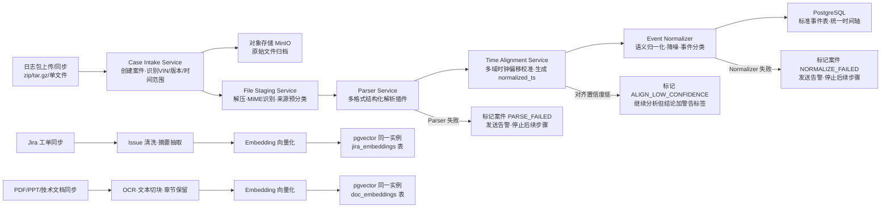
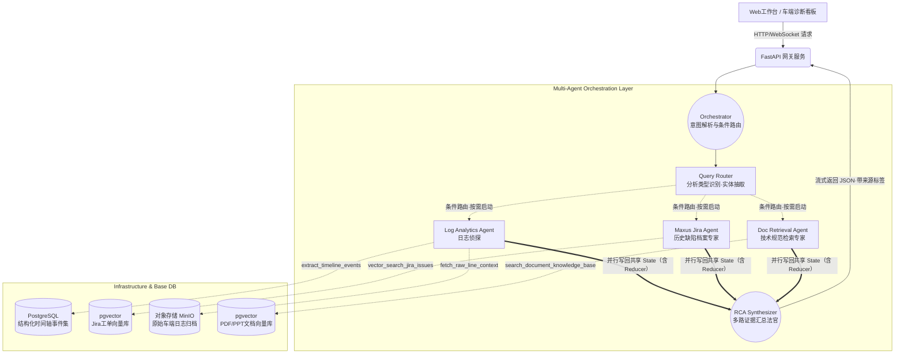

# FOTA 多域日志智能诊断系统设计方案（修订版 v5）

> **修订说明**：本版本基于 `技术设计文档.md`、`demo视频解说提取与落地架构.md`、`FOTA诊断系统开发任务清单.md` 三份原始文档进行交叉校验，修复了 LangGraph 并发实现错误、State Reducer 缺失、离线管线缺失、Doc Agent Tool 定义缺失、Query Router 缺失、时间对齐遗漏、模型型号硬编码、目标表述自相矛盾等问题。v4 进一步补充了 fan-in 显式连接声明、Query Router 输出格式规范、Parser 并发解析策略、ALIGN_FAILED 降级备选策略。

---

## 1. 总体概述

本方案旨在构建一套面向 FOTA 等复杂软硬协同故障的**多智能体（Multi-Agent）根因分析诊断系统**。

系统以外挂知识库检索（RAG）和自主职能调用（Tool Use）为基础，采用 **LangGraph** 框架进行核心流转编排。将庞大的原始日志数据池、历史缺陷案底工单库（Jira）以及官方系统设计规范（Document）三大数据源引入大模型的推理边界，实现全程可交叉回溯、**高置信度、高度自动化**的故障推测与诊断（低置信度情形下会标记人工复核标志，详见第 7 节）。

系统分为两大阶段：

1. **离线预处理阶段**：日志解析、时间对齐、事件归一化、向量入库（详见第 2 节）。
2. **在线诊断阶段**：用户提问 → Orchestrator 路由 → 多 Agent 并行分析 → RCA Synthesizer 汇总 → 报告输出（详见第 3 节）。

---

## 2. 离线数据预处理管线（在线诊断的前提基础）

在线诊断 Agent 所消费的结构化数据，均来自离线管线的处理结果。该管线是整个系统正确运转的基础，不可省略。

### 2.1 管线总览



### 2.2 Parser Service 插件列表

支持以下日志格式，每种格式对应独立可插拔解析器：

| 插件名 | 日志类型 |
|---|---|
| `parser_android` | Android logcat |
| `parser_kernel` | kernel / tombstone / ANR |
| `parser_fota` | FOTA 文本日志 |
| `parser_dlt` | DLT 格式 |
| `parser_mcu` | MCU 日志 |
| `parser_ibdu` | iBDU 日志 |
| `parser_vehicle_signal` | 车型信号导出文件 |

### 2.2.1 Parser Service 并发解析策略

针对大规模日志包（>= 1GB）的处理性能目标（30 分钟内完成全量分析），Parser Service 需采用并发解析：

- **任务分片**：Case Intake Service 在解压后，按文件粒度将每个日志文件作为独立 Arq 任务投入队列，各 Parser 插件并行消费，最大化 I/O 和 CPU 利用率。
- **Worker 配置建议**：生产环境建议每台 Parser Worker Pod 分配 4~8 核，Kubernetes HPA 根据队列积压深度自动扩缩容（目标队列长度 < 50 个待解析任务）。
- **顺序依赖保障**：Parser 任务之间无顺序依赖，可完全并行；Time Alignment Service 必须等待同一案件所有 Parser 任务完成后再启动（通过 Arq 任务依赖链或 DAG 编排实现，Arq 原生支持 async/await，与 FastAPI 事件循环无缝集成）。
- **大文件分块**：单文件超过 200MB 时，Parser 内部按行数分块（默认 100 万行/块）并行处理，合并后写入标准事件表。

### 2.3 Time Alignment Service（时间对齐，关键步骤）

车端多域日志存在异构时钟问题（Android wall clock、MCU uptime、DLT 异常时间、iBDU 时间各自独立），必须在进入 Agent 分析前完成统一。

核心能力：

- **锚点事件识别**：在多个日志源中找到同一物理事件的时间戳，作为对齐基准。
- **Offset 拟合**：为每个日志源计算时钟偏移量（`clock_offset`）和可信度（`confidence`）。
- **`normalized_ts` 生成**：所有事件统一转换为绝对时间戳字段 `normalized_ts`，供时间轴查询和 Agent 推理使用。

**时间对齐失败降级策略**：

- **全部域对齐成功**（所有日志源 `clock_confidence` >= 0.8）：正常进入 Agent 分析流程。
- **部分域对齐失败**（部分日志源 `clock_confidence` < 0.8）：继续分析，但在报告中对涉及该域的时序结论加警告标签，案件状态标记为 `ALIGN_PARTIAL`。
- **全部域对齐失败**（无法找到跨域锚点事件）：**不直接停止分析**，降级为「使用各域原始时间戳继续分析」模式，案件状态标记为 `ALIGN_FAILED`，但流程继续，最终报告顶部加醒目警告横幅：`⚠️ 时间对齐失败，本报告时序结论不可信，仅供参考，请人工复核`。同时通过告警通道（邮件 / Webhook）通知工程师补充日志。此降级策略避免在故障紧急排查时因时间对齐失败而完全阻断诊断输出。

---

## 3. 核心架构拓扑图（在线诊断）

系统架构由外至内高度解耦，统筹分为四层：表现交互层、网关层、多智能体编排核心层、底层数据基座。



---

## 4. 大模型梯次级路由设计 (Model Routing)

系统按照每个节点计算推导量的轻重缓急，混合配置不同能力等级的模型底座（具体型号以实际可用版本为准，以下为能力定位描述）：

1. **轻量高速决策模型**（如各厂商的 Flash / Haiku 级别模型）
   - **承载节点**：`Orchestrator`、`Query Router`
   - **业务职责**：快速读取用户意图、抽取分析实体（VIN、模块名、故障关键词等），输出路由矩阵，指定需要启动的 Agent 组合。

2. **长文深度推理模型**（如各厂商的 Pro / Sonnet 级别模型，支持 100k+ 上下文）
   - **承载节点**：`Log Analytics Agent`、`Jira Agent`、`Doc Retrieval Agent`、`RCA Synthesizer`
   - **业务职责**：吞吐大量结构化时间轴事件、比对历史解决档案、跨文档推理根因逻辑链。

---

## 5. Query Router 规范

### 5.0 Query Router（分析类型识别与 Agent 路由决策）

- **Prompt 人格设定**：轻量决策者，快速识别用户问题的分析类型，不进行深度推理。
- **输入**：`original_query`（用户原始问题字符串）。
- **输出**：更新 State 中的 `active_agents` 字段，格式为：

```json
{
  "active_agents": ["log", "jira", "doc"]
}
```

  路由规则示例：

  | 问题类型 | 激活 Agent 组合 |
  |---|---|
  | 日志异常/挂死/崩溃类 | `["log"]` 或 `["log", "jira"]` |
  | 历史是否有相似问题 | `["jira"]` |
  | 规范/状态机/设计预期类 | `["doc"]` 或 `["log", "doc"]` |
  | 综合根因分析 | `["log", "jira", "doc"]`（全量） |

- **约束**：输出的 `active_agents` 中每个元素必须是 `Literal["log", "jira", "doc"]` 之一，Prompt 需明确限定合法值列表，防止 LLM 输出拼写错误的字符串导致 Agent 静默跳过。
- **模型选型**：使用轻量高速模型（Flash / Haiku 级别），不需要长上下文，只需快速分类。

---

## 6. 关键智能体 (Agent) 实现级细则规范

### 5.1 Log Analytics Agent（日志侦探）

- **Prompt 人格设定**：严格约束为「底层源码验证师」，禁止凭空推测或虚构。
- **可调用工具（Tools）**：
  - `extract_timeline_events(case_id, module, time_range)` — 从 PostgreSQL 时间轴表按模块和时间段查询结构化事件。
  - `fetch_raw_line_context(file_id, line_number, context_lines)` — 从 MinIO 原始日志回源，取指定行号前后上下文。
  - `search_fota_stage_transitions(case_id)` — 专项查询 FOTA 状态机阶段跳转序列（download / verify / install / reboot）。
- **输出格式**：结构化 JSON，含 `evidence_list`（每条证据包含 `file_id`、`line_number`、`log_snippet`、`event_type`）。

### 5.2 Maxus Jira Agent（历史缺陷档案专家）

- **Prompt 人格设定**：定位为「缺陷历史图书馆员」，专注在向量库中找最相似的历史问题和修复方案。
- **可调用工具（Tools）**：
  - `vector_search_jira_issues(query_embedding, top_k, filters)` — 在 pgvector 库中执行余弦相似度检索，返回最相关的历史工单。
  - `get_jira_issue_detail(issue_id)` — 获取指定 Jira 工单完整内容（描述、根因、修复方案、关联 PR）。
- **输出格式**：结构化 JSON，含 `jira_references`（每条含 `issue_id`、`similarity_score`、`summary`、`resolution`）。

### 5.3 Doc Retrieval Agent（技术规范检索专家）

- **Prompt 人格设定**：定位为「技术标准核查员」，从官方文档和架构规范中找到与当前故障相关的设计预期行为。
- **可调用工具（Tools）**：
  - `search_document_knowledge_base(query, doc_type, top_k)` — 在 PDF/PPT 文档向量库中检索相关章节切片。
  - `get_document_chunk(chunk_id)` — 获取指定文档切片的完整原文及出处（文件名、页码）。
- **输出格式**：结构化 JSON，含 `doc_rules`（每条含 `chunk_id`、`source_file`、`page`、`content`）。

### 5.4 RCA Synthesizer（根因汇总法官）

- **Prompt 人格设定**：基于三路证据进行交叉验证，输出高置信度根因结论；若证据不足则明确标记为低置信度。
- **输入**：`log_evidence` + `jira_references` + `doc_rules`（全部来自共享 State）。
- **输出格式**：

```json
{
  "summary": "...",
  "root_cause": "...",
  "confidence": 0.92,
  "recommendations": ["..."],
  "citations": [
    {"type": "log", "ref": "[Log-Line-40502]"},
    {"type": "jira", "ref": "[Jira-Ticket-103]"}
  ]
}
```

---

## 6. 基于 LangGraph 的状态与事件流机制设计（修正版）

### 6.1 共享状态定义（含并发 Reducer）

> **修正说明**：原版 State 字段缺少 `Annotated` Reducer，三个 Agent 并行写回时后写者会覆盖先写者结果，导致数据丢失。正确做法是为所有并发写入字段加 `operator.add` Reducer，确保结果追加合并。

```python
import operator
from typing import TypedDict, Annotated, List, Literal, Optional

# 合法 Agent 名称用 Literal 约束，防止 Query Router 输出拼写错误导致 Agent 静默跳过
AgentName = Literal["log", "jira", "doc"]

class FotaDiagnosisState(TypedDict):
    original_query: str
    active_agents: List[AgentName]                        # Query Router 决定启动的 Agent（Literal 约束）
    log_evidence: Annotated[List[dict], operator.add]    # 并发写入，追加合并
    jira_references: Annotated[List[dict], operator.add] # 并发写入，追加合并
    doc_rules: Annotated[List[dict], operator.add]       # 并发写入，追加合并
    final_diagnosis: Optional[str]
    confidence: Optional[float]                          # 由规则计算，非 LLM 自评（见第7节）
    untrackable: bool
```

### 6.2 条件路由与真正并行扇出（修正版）

> **修正说明**：原版使用 `add_edge(Orchestrator, Agent_X)` 三条边，`add_edge` 是顺序边，实际执行为串行。要实现真正并行，必须使用 `Send` API 配合 `add_conditional_edges`。

```python
from langgraph.graph import StateGraph, START, END
from langgraph.types import Send
# 使用异步版 checkpointer，与 FastAPI async/await 环境兼容
from langgraph.checkpoint.postgres.aio import AsyncPostgresSaver

graph_builder = StateGraph(FotaDiagnosisState)

# 注册节点
graph_builder.add_node("query_router", query_router_func)
graph_builder.add_node("Agent_Log", log_agent_func)
graph_builder.add_node("Agent_Jira", jira_agent_func)
graph_builder.add_node("Agent_Doc", doc_agent_func)
graph_builder.add_node("Synthesizer", report_agent_func)

# 入口 -> Query Router
graph_builder.add_edge(START, "query_router")

# Query Router -> 并行扇出（Send API，真正并发）
def route_to_agents(state: FotaDiagnosisState):
    sends = []
    if "log" in state["active_agents"]:
        sends.append(Send("Agent_Log", state))
    if "jira" in state["active_agents"]:
        sends.append(Send("Agent_Jira", state))
    if "doc" in state["active_agents"]:
        sends.append(Send("Agent_Doc", state))
    return sends

graph_builder.add_conditional_edges("query_router", route_to_agents)

# ✅ fan-in 显式声明：
# Send API 创建的动态子图节点（Agent_Log / Agent_Jira / Agent_Doc）
# 在所有分支完成后，LangGraph 调度引擎会自动触发 Synthesizer。
# 必须用列表形式的 add_edge 显式声明 fan-in，确保框架版本兼容性：
graph_builder.add_edge(["Agent_Log", "Agent_Jira", "Agent_Doc"], "Synthesizer")
graph_builder.add_edge("Synthesizer", END)
# 注意：若 Query Router 仅激活部分 Agent（如仅 log + jira），
# 则 fan-in 的触发以实际被 Send 激活的节点完成为准，未激活节点不参与等待。

# 初始化异步 checkpointer（需在 async 上下文中 await setup）
async def build_app():
    async with AsyncPostgresSaver.from_conn_string(DATABASE_URL) as checkpointer:
        await checkpointer.setup()
        return graph_builder.compile(checkpointer=checkpointer)
```

---

## 7. 后端防幻觉护栏（Guardrails）

针对车规级高可靠要求，架构设两道防线：

1. **铁律约束托底（Empty Handling）**：所有 Agent Prompt 顶层植入强制指令——若通过 Tool 多轮检索后仍未找到关联信息，禁止凭空预测，必须返回：

```json
{ "untrackable": true, "message": "现场日志破损或历史库中查无该先例" }
```

2. **硬编码断言拦截网（Assertive Verification）**：Synthesizer 输出发往前端前，运行纯 Python 验证环（非 AI 逻辑）：校验报告中所有引用 ID（如 `[Jira-Ticket-103]`、`[Log-Line-40502]`）是否在原始入库素材表中真实存在。若引用 ID 为虚构，强制标记 **[低置信度 / 需人工复核]** 并返回。

> **说明**：系统目标是高度自动化诊断，但在置信度不足或证据缺失时，会主动标记人工复核标志，而非承诺绝对零人工干预。

### 7.3 置信度（confidence）计算规则

`confidence` 字段由纯代码逻辑计算，不依赖 LLM 自评（LLM 自评置信度已被广泛证明不可靠）。计算公式：

```
confidence = w1 * citation_valid_rate
           + w2 * jira_top_similarity
           + w3 * log_evidence_count_score
           + w4 * time_align_confidence

其中：
- citation_valid_rate    = 有效引用 ID 数 / 总引用 ID 数（硬编码断言验证结果）
- jira_top_similarity    = Jira 检索最高相似度得分（0~1）
- log_evidence_count_score = min(log_evidence 条数 / 5, 1.0)（命中 5 条以上得满分）
- time_align_confidence  = 时间对齐服务输出的对齐可信度均值
- 建议权重：w1=0.4, w2=0.2, w3=0.2, w4=0.2（可根据实际效果调整）

confidence < 0.6 时自动标记 [低置信度 / 需人工复核]
```

---

## 8. 多用户多任务并发控制与防串线保障

针对海量数据扫描和跨时隙请求调用的工业化场景，系统设四大隔离机制：

1. **会话读写强隔离（Thread ID Checkpoint 沙盒）**：每次诊断任务挂靠独立 `thread_id`，借助 LangGraph 的 PostgreSQL checkpointer 实现持久化快照。全局禁止复用共享内存，杜绝多用户并发时数据串线。

2. **算力解耦削峰（Message Queue 集群消费）**：FastAPI 网关将诊断请求收纳进 `Redis / RabbitMQ` 调度总线；Kubernetes Worker Pod 按资源余量异步抢配执行，对突发高并发流量削峰平滑。

3. **全链路异步（Native Async/Await）**：对外部 LLM API 的调用占据网络生命周期约 90% 的等待时长。使用原生 `async/await` 令所有 API 调用进入无锁异步，单机可承载高并发任务。

4. **限流防爆阀（Exponential Backoff Retry）**：对 LLM 服务商的调用层加装令牌桶算法和指数退避重试机制，硬性消化 `429 Too Many Requests` 错误，防止平台因并发过高被服务商封禁。

---

## 9. 技术选型

| 层次 | 技术 |
|---|---|
| 后端框架 | Python + FastAPI |
| AI 编排 | LangGraph |
| 任务队列 | Arq（原生 async/await，与 FastAPI 事件循环无缝集成，优于 Celery） |
| 消息总线 | Redis / RabbitMQ |
| 关系数据库 | PostgreSQL |
| 向量检索 | pgvector（同一 PostgreSQL 实例，Jira 用 `jira_embeddings` 表，文档用 `doc_embeddings` 表，均需预建 HNSW 索引） |
| 全文检索 | OpenSearch |
| 对象存储 | MinIO / S3 |
| 缓存 | Redis |
| 前端 | Next.js + React + TypeScript |
| 服务部署 | Python Virtualenv + Systemd |
| 报告导出 | Markdown + HTML + PDF |

---

## 10. 版本规划

### Sprint 1（P0 核心链路）

1. 多源日志解析（7 类 Parser 插件）
2. 时间对齐服务（normalized_ts 生成）
3. FOTA 状态机阶段识别
4. Log Analytics Agent + 最基础 RCA 报告输出

### Sprint 2（知识库与多 Agent）

1. Jira 工单同步与向量入库
2. PDF/PPT 文档切块与向量入库
3. Orchestrator + Query Router + 三 Agent 并行编排

### Sprint 3（前端与可视化）

1. 聊天式诊断页面（Next.js）
2. Agent 执行状态面板（AgentTimeline）
3. RCA 报告展示 + 引用来源跳转 + 导出

### Sprint 4（工程化增强）

1. 评测集建设与置信度模型
2. 权限体系与操作审计
3. 监控（请求耗时、Agent 成功率、LLM 调用失败率）
4. 多车型、多项目扩展支持

---

## 11. 性能目标

- 1 GB 日志包，30 分钟内完成全量离线分析。
- 1000 万行级别案件可分页查询。
- 时间轴接口 P95 < 2 秒。
- 案件总览接口 P95 < 1 秒。
- 在线诊断首次流式响应 < 30 秒。

---

## 12. 修订记录

| 版本 | 修订内容 |
|---|---|
| v1 | 初始版本（基于 demo 视频与技术设计文档生成） |
| v2 | 修复 LangGraph 并发边（Send API）；修复 State Reducer；补充离线管线；补充 Doc Agent Tool；补充 Query Router；补充时间对齐；模型型号改为能力描述；修正目标表述矛盾 |
| v3 | 修复 fan-in 写法（Send API 后不能用静态 add_edge 汇入 Synthesizer）；PostgresSaver 改为 AsyncPostgresSaver；active_agents 加 Literal 约束；补充 pgvector HNSW 索引说明及同实例双表说明；补充 confidence 量化计算规则；补充时间对齐三档降级策略；离线管线补充三类错误处理节点 |
| v4 | 补充 fan-in 显式 add_edge 列表声明及部分 Agent 激活时的触发说明；新增第 5.0 节 Query Router 输出格式规范（JSON 结构、路由规则表、Literal 约束要求）；新增第 2.2.1 节 Parser Service 并发解析策略（任务分片、Worker 配置、顺序依赖保障、大文件分块）；ALIGN_FAILED 降级策略由「停止分析」改为「降级继续分析+顶部警告横幅+异步告警通知」，避免紧急排查时完全阻断诊断输出 |
| v5 | 任务队列由「Celery 或 Arq」统一改为 Arq（原生 async/await，与 FastAPI 事件循环无缝集成，性能更优）；Parser 并发策略中 Celery chord 改为 Arq 任务依赖链 |
