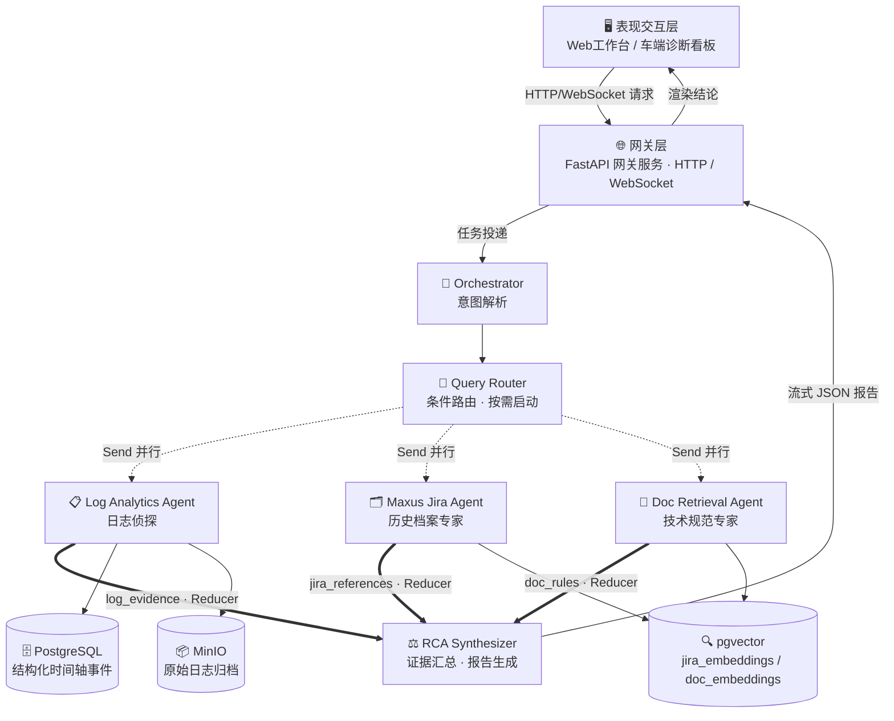
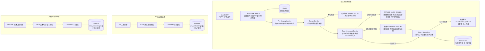
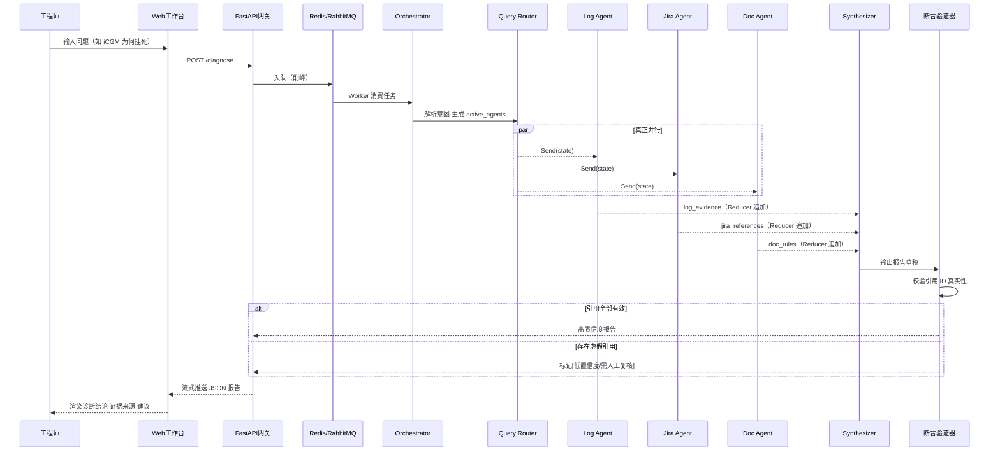
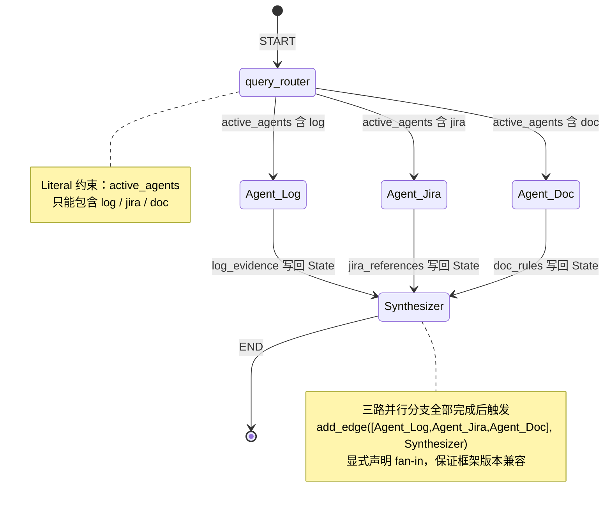
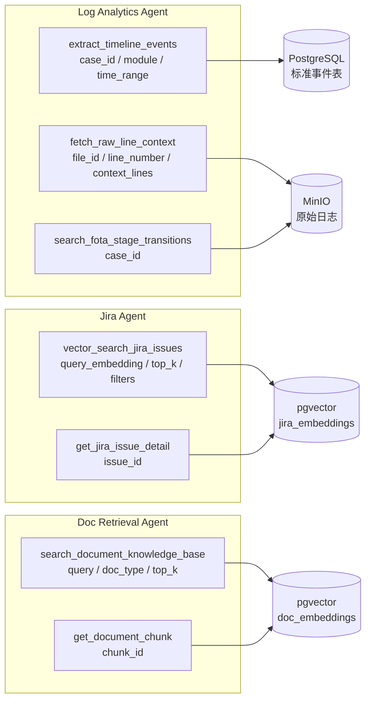
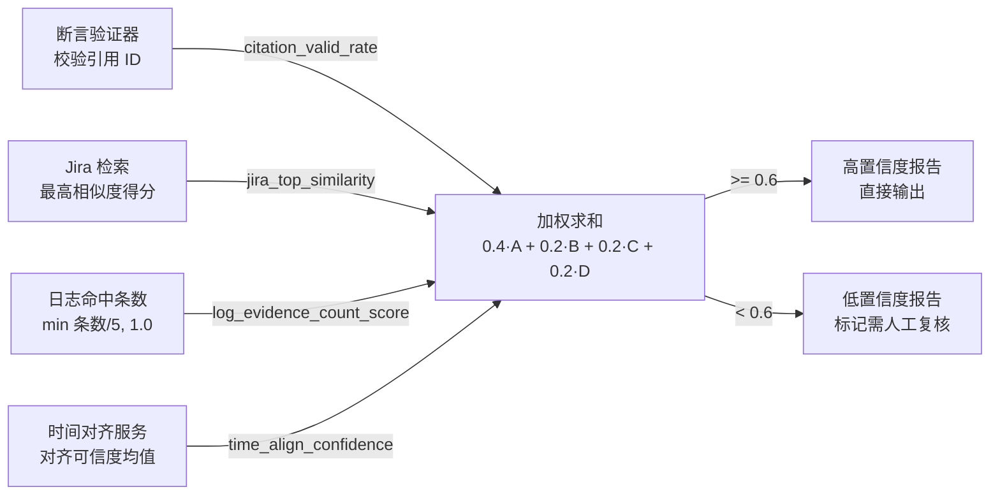
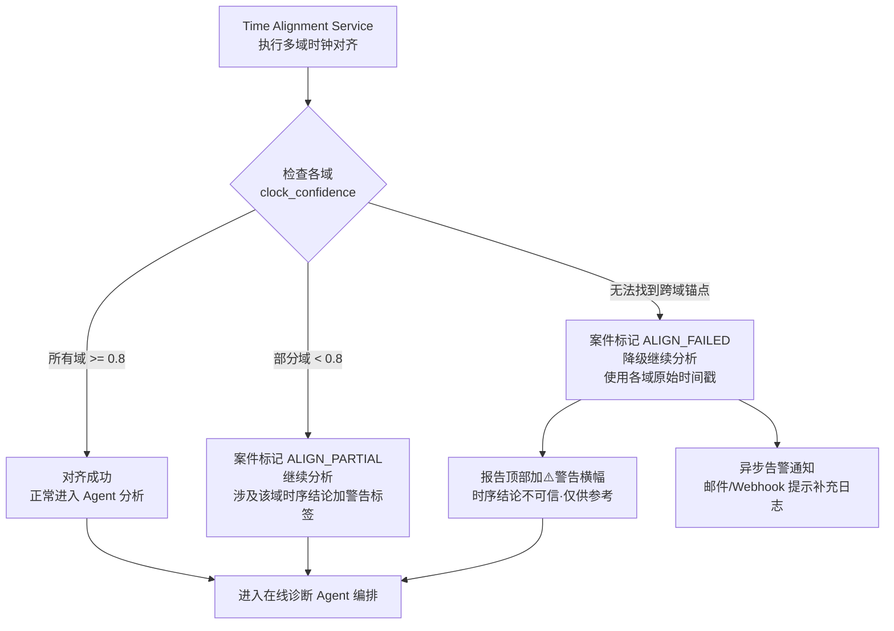
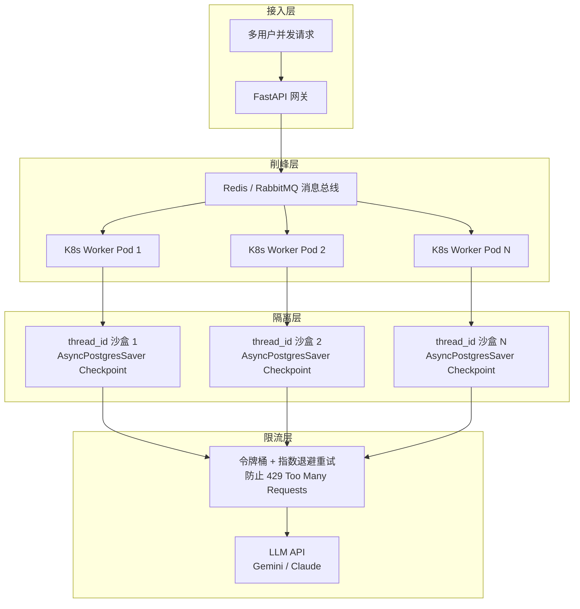

# FOTA 多域日志智能诊断系统 — 设计图文档

> 本文档提取自《FOTA智能诊断平台_系统设计方案.md》v4，专门汇集系统各层架构图、流程图、时序图，供开发、评审和演示使用。

---

## 图 1：系统总体分层架构

---

## 图 2：离线数据预处理管线

---

## 图 3：在线诊断请求完整时序

---

## 图 4：LangGraph 状态图（State Machine）

---

## 图 5：多 Agent 工具调用关系图

---

## 图 6：置信度计算流程

---

## 图 7：时间对齐降级策略流程

---

## 图 8：并发控制与防串线架构

