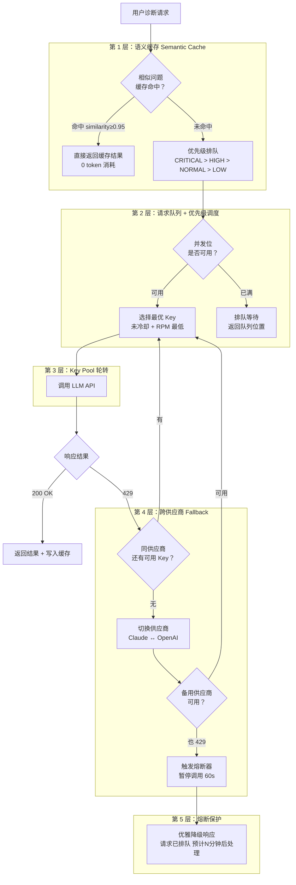
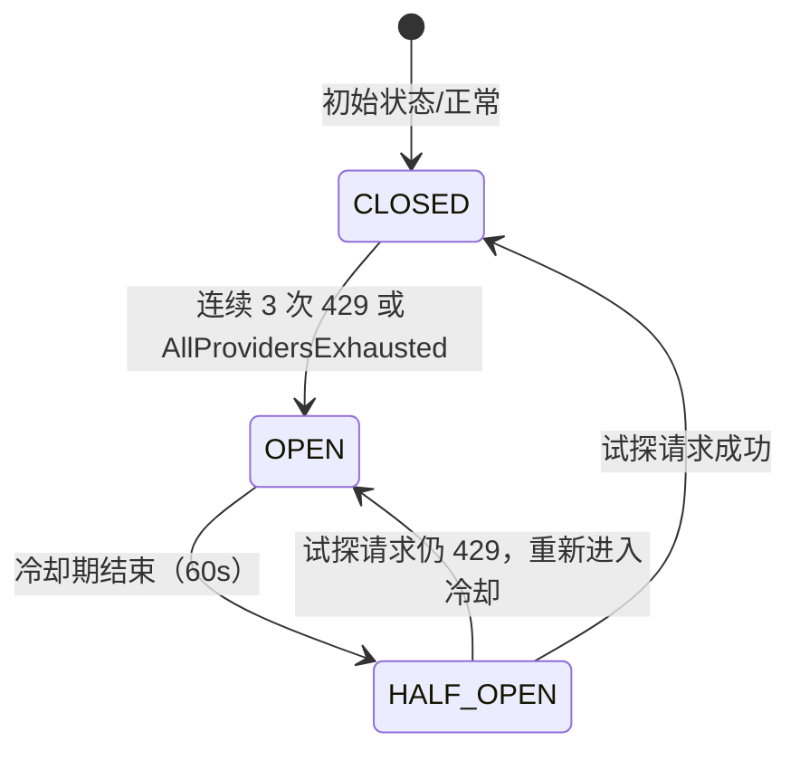

# LLM API 429 限流防御方案

> **文档版本**：v1.0
> **创建日期**：2026-03-30
> **适用范围**：FOTA 多域日志智能诊断平台 — 在线诊断阶段所有 LLM API 调用

---

## 1. 问题背景

FOTA 智能诊断平台在线诊断阶段依赖 LLM API（Claude / OpenAI）完成意图路由、日志分析、历史匹配、文档检索和根因汇总。在以下场景中，LLM API 的速率限制（HTTP 429 Too Many Requests）将成为系统瓶颈：

- **批量 OTA 故障**：同一批次几十台车报相同错误，多名工程师同时发起诊断
- **高并发用户**：多个项目组同时使用平台
- **单次诊断内部并行**：一次诊断可能并行调用 3 个 Agent（Log / Jira / Doc），每个 Agent 内部可能多轮 Tool Use 调用

### 1.1 主流 LLM 服务商速率限制参考

| 服务商 | 模型层级 | RPM（请求/分钟） | TPM（Token/分钟） |
|---|---|---|---|
| Anthropic Claude | Haiku | 较高 | 较高 |
| Anthropic Claude | Sonnet | 中等 | 中等 |
| Anthropic Claude | Opus | 较低 | 较低 |
| OpenAI | GPT-4o-mini | 较高 | 较高 |
| OpenAI | GPT-4o | 中等 | 中等 |

> 具体数值随付费层级（Tier）和时间变化，以官方文档为准。企业级账号的限额通常高于个人/Team 层级数倍。

---

## 2. 五层防御架构总览



---

## 3. 第 1 层：语义缓存（Semantic Cache）

### 3.1 核心原理

FOTA 诊断场景的问题天然具有重复性——同款车型 + 同症状的问题会反复出现。语义缓存通过对用户 Prompt 计算 Embedding 向量，与历史请求做相似度匹配，命中则直接返回缓存结果，**从根源上减少 LLM 调用量**。

### 3.2 缓存架构

```
┌──────────────────────────────────────────────────┐
│                 语义缓存层                         │
│                                                  │
│  ┌──────────┐    ┌─────────────────────────┐     │
│  │ Embedding │    │ PostgreSQL + pgvector   │     │
│  │ Service   │    │ semantic_cache 表        │     │
│  │           │    │                         │     │
│  │ 输入 prompt│───>│ prompt_embedding (vec)  │     │
│  │ → 向量     │    │ prompt_hash (SHA256)    │     │
│  └──────────┘    │ response_text           │     │
│                  │ model_used              │     │
│                  │ created_at              │     │
│                  │ ttl_expires_at          │     │
│                  │ hit_count               │     │
│                  └─────────────────────────┘     │
└──────────────────────────────────────────────────┘
```

### 3.3 缓存策略

| 参数 | 值 | 说明 |
|---|---|---|
| 相似度阈值 | `>= 0.95` | 防止语义漂移导致错误命中 |
| 缓存 TTL | Router 层: 24h / Agent 层: 4h / Synthesizer: 2h | 越靠近最终输出，缓存时效越短 |
| 缓存粒度 | 按 `{model + prompt_hash + tool_results_hash}` 联合键 | Tool 结果变了（新日志入库），缓存自动失效 |
| 失效策略 | TTL 过期 / 新日志入库时按 case_id 清除关联缓存 | 确保数据更新后不返回旧结论 |

### 3.4 预估收益

| 场景 | 缓存命中率预估 | LLM 调用减少量 |
|---|---|---|
| 批量 OTA 故障（同批次 N 台车同症状） | 70~90% | 显著 |
| 同一 case 多人查看 | 95%+ | 几乎完全缓存 |
| 日常零散诊断 | 10~30% | 一般 |
| **综合预估** | **50~70%** | — |

### 3.5 实现伪代码

```python
from hashlib import sha256

SIMILARITY_THRESHOLD = 0.95

async def llm_call_with_semantic_cache(
    prompt: str,
    model: str,
    tool_results_hash: str | None = None,
    cache_ttl: int = 3600,
) -> str:
    # 1. 快速精确匹配（SHA256 哈希，O(1) 查找）
    prompt_hash = sha256(prompt.encode()).hexdigest()
    exact_hit = await db.fetch_one(
        "SELECT response_text FROM semantic_cache "
        "WHERE prompt_hash = $1 AND model = $2 AND ttl_expires_at > NOW()",
        prompt_hash, model
    )
    if exact_hit:
        await db.execute("UPDATE semantic_cache SET hit_count = hit_count + 1 WHERE prompt_hash = $1", prompt_hash)
        return exact_hit["response_text"]

    # 2. 语义模糊匹配（pgvector 余弦相似度）
    prompt_embedding = await embedding_service.encode(prompt)
    semantic_hit = await db.fetch_one(
        "SELECT response_text, 1 - (prompt_embedding <=> $1) AS similarity "
        "FROM semantic_cache "
        "WHERE model = $2 AND ttl_expires_at > NOW() "
        "ORDER BY prompt_embedding <=> $1 LIMIT 1",
        prompt_embedding, model
    )
    if semantic_hit and semantic_hit["similarity"] >= SIMILARITY_THRESHOLD:
        return semantic_hit["response_text"]

    # 3. 未命中 → 调用 LLM（进入后续防御层）
    response = await llm_call_with_rate_limit(prompt, model)

    # 4. 写入缓存
    await db.execute(
        "INSERT INTO semantic_cache (prompt_hash, prompt_embedding, model, response_text, ttl_expires_at) "
        "VALUES ($1, $2, $3, $4, NOW() + INTERVAL '$5 seconds')",
        prompt_hash, prompt_embedding, model, response, cache_ttl
    )
    return response
```

---

## 4. 第 2 层：请求队列 + 优先级调度

### 4.1 优先级定义

| 优先级 | 级别 | 场景 | 并发保留数 |
|---|---|---|---|
| `P1 CRITICAL` | 最高 | 路上抛锚 / 安全相关故障 | 5 |
| `P2 HIGH` | 高 | 工程师主动发起诊断 | 10 |
| `P3 NORMAL` | 中 | 批量回溯分析 | 4 |
| `P4 LOW` | 低 | 定时巡检 / 后台全量解析 | 1 |

### 4.2 队列配置

```python
QUEUE_CONFIG = {
    "max_concurrent_llm_calls": 20,          # 全局 LLM 并发上限
    "per_priority_reserve": {
         1: 5,    # CRITICAL 始终保留 5 个并发位
         2: 10,
         3: 4,
         4: 1,
    },
    "queue_max_wait_seconds": 300,            # 排队超时 5 分钟
    "queue_max_depth": 200,                   # 队列最大深度
}
```

### 4.3 用户反馈

排队时向前端推送实时状态：

```json
{
    "status": "queued",
    "queue_position": 3,
    "estimated_wait_seconds": 45,
    "message": "您的诊断请求已排队，前方还有 3 个任务，预计 45 秒后开始处理"
}
```

---

## 5. 第 3 层：Key Pool 轮转

### 5.1 设计原则

- 所有 API Key 必须来自**同一企业实体下的合法子项目/子账号**，不使用多个虚假账号
- OpenAI：利用同一 Organization 下的多个 Project（官方支持，每个 Project 有独立 Rate Limit）
- Claude：通过 AWS Bedrock 多 Region 部署，或 Anthropic API 企业级提额

### 5.2 Key Pool 结构

```python
class LLMKeyPool:
    """LLM API Key 负载均衡池"""

    def __init__(self, keys_config: list[dict]):
        self.keys = []
        for cfg in keys_config:
            self.keys.append({
                "id": cfg["id"],
                "api_key": cfg["api_key"],
                "provider": cfg["provider"],       # "claude" | "openai"
                "model_tier": cfg["model_tier"],    # "haiku" | "sonnet" | "gpt4o-mini" | "gpt4o"
                "rpm_limit": cfg["rpm_limit"],
                "tpm_limit": cfg["tpm_limit"],

                # 运行时状态
                "current_rpm": 0,
                "current_tpm": 0,
                "consecutive_429s": 0,
                "cooldown_until": None,
                "last_success_at": None,
            })

    def get_best_key(self, provider: str, model_tier: str) -> dict | None:
        """选择最优 Key：未冷却 + 当前 RPM 利用率最低"""
        now = datetime.utcnow()
        candidates = [
            k for k in self.keys
            if k["provider"] == provider
            and k["model_tier"] == model_tier
            and (k["cooldown_until"] is None or now > k["cooldown_until"])
        ]
        if not candidates:
            return None
        return min(candidates, key=lambda k: k["current_rpm"] / k["rpm_limit"])

    def mark_429(self, key_id: str):
        """记录 429，进入指数退避冷却期"""
        key = self._find_key(key_id)
        key["consecutive_429s"] += 1
        backoff_seconds = min(2 ** key["consecutive_429s"], 120)  # 最长冷却 2 分钟
        key["cooldown_until"] = datetime.utcnow() + timedelta(seconds=backoff_seconds)

    def mark_success(self, key_id: str, tokens_used: int):
        """成功调用，重置连续 429 计数"""
        key = self._find_key(key_id)
        key["consecutive_429s"] = 0
        key["cooldown_until"] = None
        key["current_rpm"] += 1
        key["current_tpm"] += tokens_used
        key["last_success_at"] = datetime.utcnow()
```

### 5.3 配置示例

```yaml
# config/llm_keys.yaml
keys:
  # Claude 通道（企业账号下多个 Workspace / Bedrock 多 Region）
  - id: claude-sonnet-1
    provider: claude
    model_tier: sonnet
    api_key: "${CLAUDE_API_KEY_1}"
    rpm_limit: 60
    tpm_limit: 80000

  - id: claude-sonnet-2
    provider: claude
    model_tier: sonnet
    api_key: "${CLAUDE_API_KEY_2}"
    rpm_limit: 60
    tpm_limit: 80000

  - id: claude-haiku-1
    provider: claude
    model_tier: haiku
    api_key: "${CLAUDE_API_KEY_1}"
    rpm_limit: 200
    tpm_limit: 200000

  # OpenAI 通道（同 Org 下多 Project）
  - id: openai-gpt4o-1
    provider: openai
    model_tier: gpt4o
    api_key: "${OPENAI_API_KEY_PROJECT_A}"
    rpm_limit: 100
    tpm_limit: 150000

  - id: openai-gpt4o-2
    provider: openai
    model_tier: gpt4o
    api_key: "${OPENAI_API_KEY_PROJECT_B}"
    rpm_limit: 100
    tpm_limit: 150000

  - id: openai-gpt4o-mini-1
    provider: openai
    model_tier: gpt4o-mini
    api_key: "${OPENAI_API_KEY_PROJECT_A}"
    rpm_limit: 500
    tpm_limit: 2000000
```

---

## 6. 第 4 层：跨供应商 Fallback

### 6.1 Fallback 路由逻辑

```python
# 模型等价映射表（同层级可互换）
FALLBACK_MAP = {
    # primary provider/model → fallback provider/model
    ("claude", "haiku"):   ("openai", "gpt4o-mini"),
    ("claude", "sonnet"):  ("openai", "gpt4o"),
    ("openai", "gpt4o-mini"): ("claude", "haiku"),
    ("openai", "gpt4o"):     ("claude", "sonnet"),
}

async def call_with_fallback(prompt: str, provider: str, model_tier: str) -> str:
    # 尝试主供应商
    key = key_pool.get_best_key(provider, model_tier)
    if key:
        try:
            return await _raw_llm_call(prompt, key)
        except RateLimitError:
            key_pool.mark_429(key["id"])
            # 尝试同供应商的其他 Key
            alt_key = key_pool.get_best_key(provider, model_tier)
            if alt_key:
                try:
                    return await _raw_llm_call(prompt, alt_key)
                except RateLimitError:
                    key_pool.mark_429(alt_key["id"])

    # 主供应商无可用 Key → 切换到备用供应商
    fb_provider, fb_model = FALLBACK_MAP.get((provider, model_tier), (None, None))
    if fb_provider:
        fb_key = key_pool.get_best_key(fb_provider, fb_model)
        if fb_key:
            try:
                return await _raw_llm_call(prompt, fb_key)
            except RateLimitError:
                key_pool.mark_429(fb_key["id"])

    # 所有通道耗尽 → 进入熔断
    raise AllProvidersExhaustedError()
```

### 6.2 Prompt 兼容性注意

Claude 和 OpenAI 的 API 格式不同（message structure、tool definition schema），切换时需要通过统一抽象层自动转换，不应该让业务层感知到供应商差异。

---

## 7. 第 5 层：熔断保护（Circuit Breaker）

### 7.1 熔断器状态机



### 7.2 熔断配置

```python
CIRCUIT_BREAKER_CONFIG = {
    "failure_threshold": 3,         # 连续 N 次失败触发熔断
    "breaker_duration_seconds": 60, # 熔断持续时间
    "half_open_max_calls": 1,       # 半开状态试探请求数
    "success_threshold": 2,         # 连续 N 次成功恢复正常
}
```

### 7.3 优雅降级响应

熔断触发时，向用户返回友好提示而非错误页：

```json
{
    "status": "service_degraded",
    "message": "诊断服务暂时繁忙，您的请求已自动排入等待队列",
    "retry_after_seconds": 60,
    "queue_position": 5,
    "suggestion": "您也可以稍后在「历史诊断」页面查看结果，系统会在恢复后自动完成分析"
}
```

---

## 8. 监控与告警

### 8.1 核心监控指标

| 指标 | 采集方式 | 告警阈值 |
|---|---|---|
| LLM 429 错误率 | Prometheus Counter | > 10% / 5min 窗口 |
| Key Pool 可用 Key 数 | Gauge | < 2 |
| 语义缓存命中率 | Counter ratio | < 30% （异常偏低） |
| 请求队列深度 | Gauge | > 100 |
| 熔断器状态 | State metric | OPEN 状态持续 > 3min |
| 平均 LLM 响应延迟 | Histogram | P95 > 15s |

### 8.2 告警通道

- **即时告警**（熔断触发 / 全部 Key 冷却）：企业微信 / 钉钉 Webhook
- **日报汇总**（429 趋势、缓存命中率、成本统计）：邮件 + Grafana Dashboard

---

## 9. 长期措施

| 措施 | 说明 | 优先级 |
|---|---|---|
| **企业级 API 提额** | 与 Anthropic / OpenAI 签订企业合同，获得更高 RPM/TPM 限额 | P0（商务层面） |
| **AWS Bedrock 部署** | 通过 Bedrock 调用 Claude，Amazon 提供 SLA 和更高吞吐 | P1 |
| **Azure OpenAI 部署** | 通过 Azure 调用 GPT-4o，PTU（预留吞吐单元）保障性能 | P1 |
| **Prompt 压缩优化** | 减少每次调用的 Token 数，间接降低 TPM 消耗 | P2 |
| **本地小模型分流** | Router 层用本地 Qwen/Llama 处理，云端 API 只用于 Agent 和 Synthesizer | P2 |

---

## 10. 实施优先级

| Sprint | 实施内容 |
|---|---|
| **Sprint 1** | Key Pool 轮转 + 指数退避重试 + 熔断器（基础防护） |
| **Sprint 2** | 请求队列 + 优先级调度 + 跨供应商 Fallback |
| **Sprint 3** | 语义缓存 + 监控告警 Dashboard |
| **长期** | 企业级提额 + Bedrock/Azure PTU + Prompt 压缩 |
